# Java 테스트 코드 학습 Day 1 정리 📚

> **학습 날짜**: 2025-10-19
> **학습 시간**: 약 2시간
> **진행 상태**: Phase 1 완료 ✅

---

## 📑 목차

1. [Phase 1: 기초 개념 학습](#phase-1-기초-개념-학습)
2. [심화 질문 Q1-Q4](#심화-질문-q1-q4)
3. [지인 테스트 코드 분석](#지인-테스트-코드-분석)
4. [내일 학습 계획](#내일-학습-계획-phase-2)

---

## Phase 1: 기초 개념 학습

### 1.1 JUnit 5 핵심 개념과 생명주기

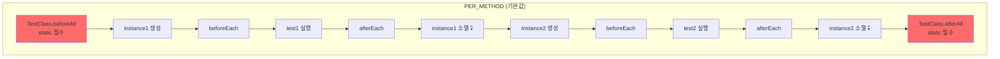

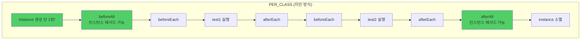

**핵심 차이점**:

| 항목 | PER_METHOD | PER_CLASS (지인 방식) |
|-----|-----------|---------------------|
| 인스턴스 생성 | 테스트마다 | 클래스당 1번 |
| `@BeforeAll`/`@AfterAll` | static 필수 | 인스턴스 메서드 가능 |
| final 필드 | 불가능 | 가능 ✅ |
| 테스트 격리 | 완벽 | 필드 상태 공유 주의 |
| 초기화 비용 | 매번 | 1번만 |

**지인이 PER_CLASS를 선택한 이유**:
- ✅ FixtureMonkey를 `final`로 안전하게 선언
- ✅ 초기화 비용 절감
- ✅ 모든 테스트에서 동일한 설정 공유

---

### 1.2 Mockito 기본 사용법

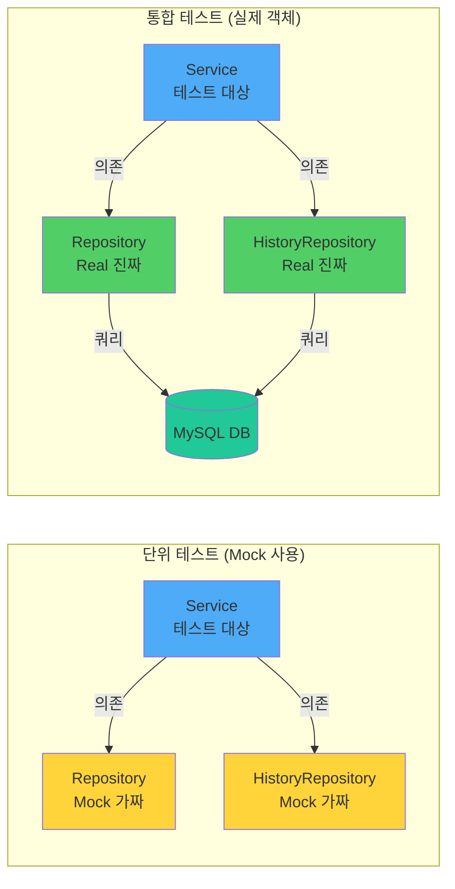

**Mock vs 실제 객체 비교**:

| 구분 | 단위 테스트 (Mock) | 통합 테스트 (실제) |
|-----|------------------|------------------|
| **속도** | ⚡⚡⚡ ~0.1초 | ⚡ ~2-5초 |
| **DB 필요** | ❌ | ✅ |
| **검증 범위** | Service 로직만 | 전체 흐름 |
| **실패 원인** | Service 문제 | Service/DB 중 어디든 |
| **동시성 테스트** | ❌ 불가능 | ✅ 가능 (실제 락) |

**언제 무엇을 사용할까?**:
- **Mock**: 빠른 로직 검증, 예외 처리, 경계값 테스트
- **실제**: 동시성, 복잡한 쿼리, 전체 흐름 검증
- **비율**: 단위 70% : 통합 30% (테스트 피라미드)

---

### 1.3 Spring Boot 테스트 애노테이션

```mermaid
graph TB
    subgraph "테스트 계층 구조"
        A[@DataJpaTest<br/>빠름 ⚡⚡⚡] --> B[JPA 빈만 로드<br/>EntityManager, Repository]
        C[@WebMvcTest<br/>빠름 ⚡⚡] --> D[MVC 빈만 로드<br/>Controller, Filter]
        E[@SpringBootTest<br/>느림 ⚡] --> F[전체 컨텍스트 로드<br/>모든 빈]
    end

    style A fill:#51cf66
    style C fill:#fab005
    style E fill:#ff6b6b
```

**지인의 AbstractJpaTest 구조**:

```java
@DataJpaTest  // JPA 빈만 로드
@Import(TestTransactionConfig.class)  // 추가 설정
@ContextConfiguration(initializers = JpaBeanInitializer.class)  // Repository 자동 스캔
@AutoConfigureTestDatabase(replace = NONE)  // 실제 MySQL 사용
```

**핵심 포인트**:
- `@DataJpaTest`: 빠른 Repository 테스트
- `JpaBeanInitializer`: @Repository 자동 스캔 (수동 지정 불필요!)
- `replace = NONE`: H2 대신 실제 MySQL 사용 → 동시성 테스트 가능

---

### 1.4 Fixture Monkey

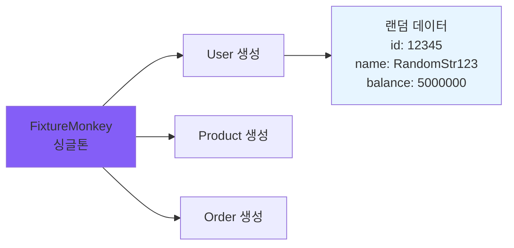

**기본 사용법**:

```java
// 1. 랜덤 객체 생성
User user = fixture.giveMeOne(User.class);

// 2. 특정 값 지정
User user = fixture.giveMeBuilder(User.class)
    .setNull("id")  // JPA 자동 생성
    .set("pointBalance", 10_000L)  // 고정값
    .sample();

// 3. 여러 개 생성
List<User> users = fixture.giveMe(User.class, 10);
```

**지인의 설정 (FixtureMonkeyFactory)**:
```java
private static final FixtureMonkey INSTANCE = FixtureMonkey.builder()
    .objectIntrospector(new FailoverIntrospector(...))  // 여러 방식 시도
    .defaultNotNull(true)  // null 방지
    .plugin(new SimpleValueJqwikPlugin()
        .minNumberValue(1)
        .maxNumberValue(20_000_000)
    )
    .build();
```

---

## 심화 질문 Q1-Q4

### Q1. PER_METHOD일 때 왜 @BeforeAll/@AfterAll에 static이 필요한가?

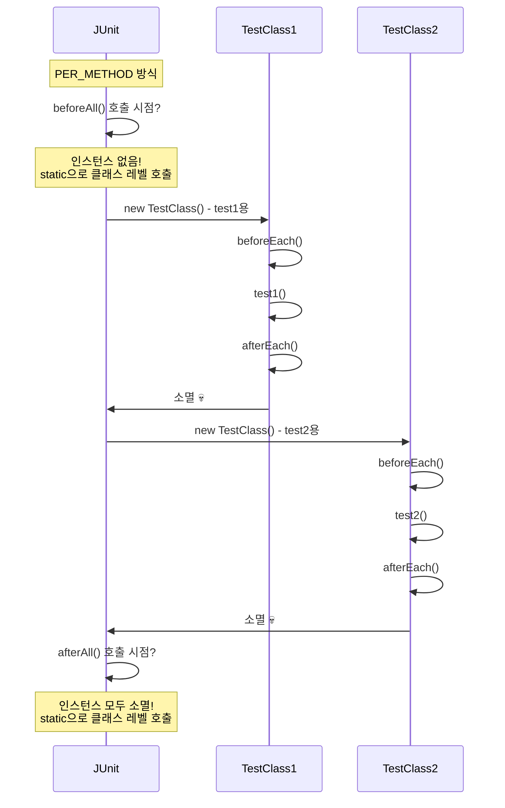

**핵심**:
- PER_METHOD: 인스턴스가 계속 생성/소멸
- `@BeforeAll`/`@AfterAll`: 모든 테스트 전/후 딱 1번 실행
- 인스턴스 없이 실행해야 하므로 → **static 필수**

---

### Q2. 왜 굳이 Mock을 만들어야 하나?

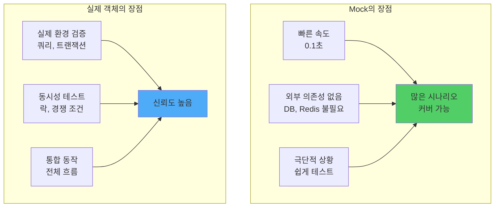

**결론**: 둘 다 필요! 단위 70% + 통합 30%

---

### Q3. 테스트 전용 DB를 띄우려면?


**비교표**:

| 방법 | 속도 | 운영 유사도 | 자동화 | 추천 상황 |
|-----|------|-----------|-------|---------|
| H2 | ⚡⚡⚡ | ⚠️ 낮음 | ✅ | 빠른 CRUD 테스트 |
| 수동 Docker | ⚡⚡ | ✅ 높음 | ⚠️ 수동 | 로컬 개발 |
| TestContainers | ⚡ | ✅✅ 매우 높음 | ✅ | CI/CD |

**지인의 선택**: 방법 2 (수동 Docker) - 로컬 개발에 최적화

---

### Q4. FixtureMonkey 초기화 비용 측정

**실제 측정 결과** (당신의 환경):

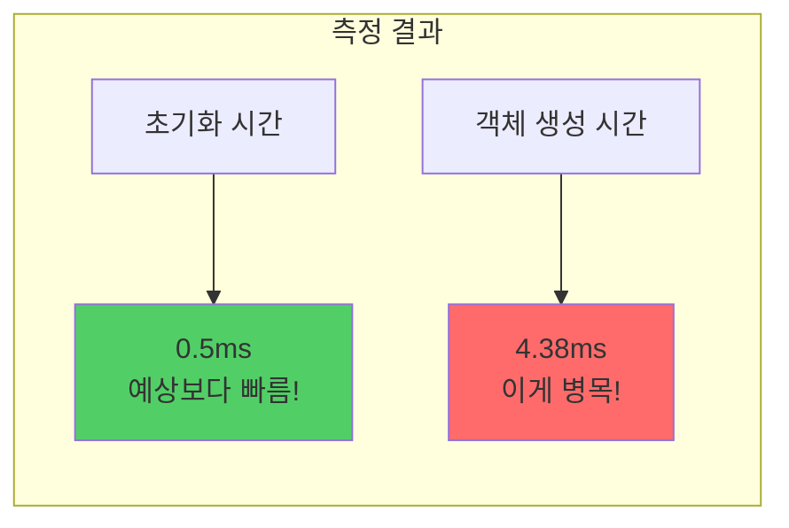

**초기 예상**:
```
초기화: 150ms (매우 비쌈)
객체 생성: 0.5ms (빠름)
→ 싱글톤이 300배 빠를 것!
```

**실제 결과**:
```
초기화: 0.5ms (빠름!)
객체 생성: 4.38ms (느림)
→ 싱글톤의 주 목적은 초기화 절약이 아니라
   "일관성 유지"와 "final 필드"!
```

**싱글톤 출력이 안 나왔던 이유**:

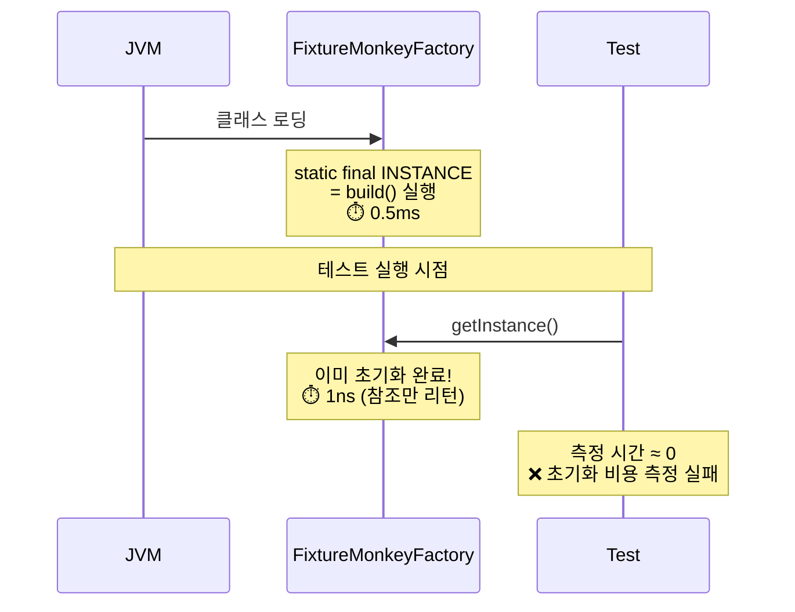

**해결**:
```java
// ❌ 이미 초기화됨
FixtureMonkey fm = FixtureMonkeyFactory.getInstance();

// ✅ 직접 생성하여 측정
FixtureMonkey fm = createFixtureMonkey();
```

---

### JMH (Java Microbenchmark Harness)

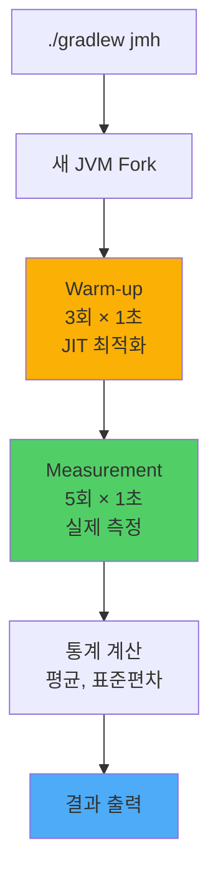

**JMH vs 일반 테스트**:

| 항목 | System.nanoTime() | JMH |
|-----|------------------|-----|
| JIT 최적화 | ❌ 포함 안 됨 | ✅ Warm-up 후 측정 |
| 콘솔 I/O | ⚠️ 측정에 포함 | ✅ Blackhole로 제외 |
| GC 영향 | ⚠️ 랜덤 | ✅ Fork로 격리 |
| 통계 | ❌ 수동 계산 | ✅ 자동 제공 |
| 정확도 | ⚠️ 낮음 | ✅ 높음 |

**사용 시나리오**:
- ✅ 라이브러리 선택 (A vs B 성능 비교)
- ✅ 최적화 전/후 비교
- ✅ CI/CD 성능 회귀 테스트
- ❌ 간단한 실험 (오버킬)

---

## 지인 테스트 코드 분석

### 전체 구조

```mermaid
graph TB
    subgraph "support 패키지 (인프라)"
        A[AbstractTest<br/>PER_CLASS + FixtureMonkey]
        A --> B[AbstractJpaTest<br/>@DataJpaTest]
        A --> C[AbstractIntegrationServiceTest<br/>@SpringBootTest]
        C --> D[AbstractConcurrencyTest<br/>TestTransactionSupport]

        E[JpaBeanInitializer<br/>Repository 자동 스캔]
        F[FixtureMonkeyFactory<br/>싱글톤]
        G[AutoMockExtension<br/>PER_CLASS Mock]
        H[TestTransactionSupport<br/>동시성용 트랜잭션]
    end

    subgraph "테스트 클래스"
        I[ProductRepositoryTest] -.extends.-> B
        J[PointServiceV2Test] -.uses.-> G
        K[PointServiceV2ConcurrencyTest] -.extends.-> D
    end

    style A fill:#845ef7
    style B fill:#51cf66
    style C fill:#4dabf7
    style D fill:#ff6b6b
```

### 핵심 설계 의도

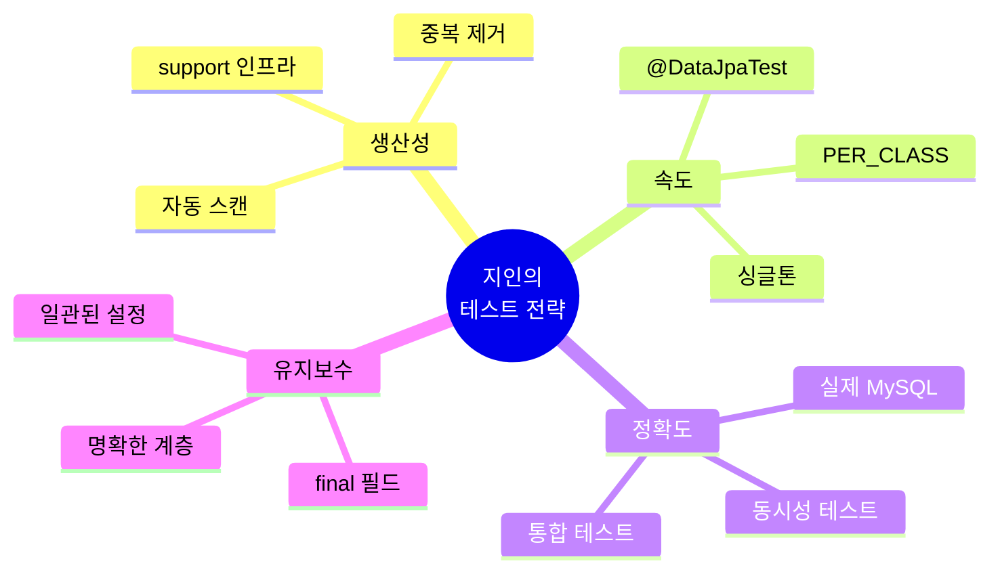

**핵심 원칙**:
1. **계층 분리**: Repository(빠름) vs Service(전체) vs Concurrency(동시성)
2. **중복 제거**: 공통 설정을 상위 클래스에 집중
3. **자동화**: Repository 스캔, Mock 초기화, 트랜잭션 관리
4. **실전 중심**: 실제 MySQL, 실제 락, 실제 동시성

---

## 내일 학습 계획 (Phase 2)

### Phase 2: 지인 방식 이해 및 실습 (60분)

```mermaid
gantt
    title Phase 2 학습 계획
    dateFormat HH:mm
    axisFormat %H:%M

    section 인프라 이해
    JpaBeanInitializer 원리       :a1, 10:00, 20m
    TestTransactionSupport 활용   :a2, after a1, 15m
    AutoMockExtension 분석        :a3, after a2, 15m

    section 동시성 패턴
    CountDownLatch & ExecutorService :b1, after a3, 20m
    CompletableFuture               :b2, after b1, 10m

    section 실습
    포인트 따닥 방지 테스트          :c1, after b2, 30m
```

### 학습 목표

#### 2.1 JpaBeanInitializer 원리 (20분)
- **문제**: @DataJpaTest는 기본적으로 Repository를 자동 스캔하지 않음
- **해결**: ApplicationContextInitializer로 수동 스캔
- **실습**: 새 Repository 추가 시 자동 인식 확인

#### 2.2 TestTransactionSupport 활용 (15분)
- **문제**: 동시성 테스트에서 트랜잭션 격리 필요
- **해결**: `PROPAGATION.REQUIRES_NEW`로 별도 트랜잭션
- **실습**: 동시성 테스트에서 데이터 준비

#### 2.3 AutoMockExtension 분석 (15분)
- **문제**: 기본 MockitoExtension은 PER_METHOD 전용
- **해결**: PER_CLASS에서 작동하는 Extension 구현
- **실습**: Mock 재사용 및 자동 reset() 확인

#### 2.4 동시성 테스트 패턴 (30분)
- **CountDownLatch**: 여러 스레드 동시 시작
- **ExecutorService**: 스레드 풀 관리
- **CompletableFuture**: 비동기 실행 및 결과 대기

#### 2.5 실전 예제 (30분)
- 재고 차감 동시성 테스트
- 포인트 충전/사용 락 테스트
- 실패 시나리오 검증

---

## 복습용 핵심 요약

### 테스트 베이스 클래스 선택 가이드

```mermaid
graph TD
    A{무엇을 테스트?} --> B[Repository]
    A --> C[Service]
    A --> D[Controller]

    B --> E[AbstractJpaTest<br/>@DataJpaTest]
    C --> F{동시성 필요?}
    F -->|Yes| G[AbstractConcurrencyTest]
    F -->|No| H[AbstractIntegrationServiceTest]
    D --> I[@WebMvcTest]

    style E fill:#51cf66
    style G fill:#ff6b6b
    style H fill:#4dabf7
```

### Mock vs 실제 의사결정 트리

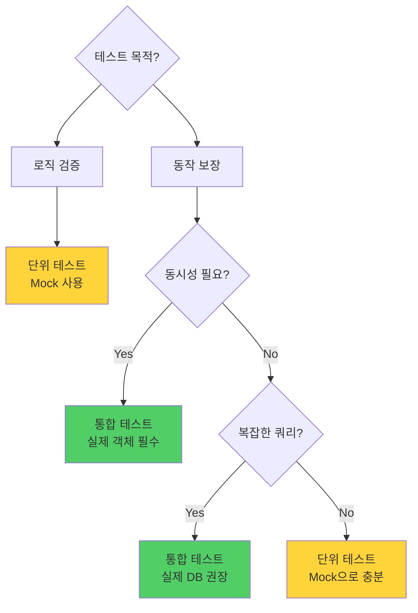

### 주요 코드 스니펫

**1. FixtureMonkey 사용**:
```java
// AbstractTest 상속 시 바로 사용 가능
User user = fixture.giveMeBuilder(User.class)
    .setNull("id")
    .set("pointBalance", 10_000L)
    .sample();
```

**2. Mock 테스트**:
```java
@ExtendWith(AutoMockExtension.class)
class ServiceTest extends AbstractTest {
    @InjectMocks private PointServiceV2 sut;
    @Mock private UserRepository userRepository;

    @Test
    void test() {
        BDDMockito.given(userRepository.findById(1L))
            .willReturn(Optional.of(user));
        // ...
    }
}
```

**3. Repository 테스트**:
```java
class ProductRepositoryTest extends AbstractJpaTest {
    @Autowired private ProductRepository productRepository;

    @Test
    void test() {
        Product product = fixture.giveMeOne(Product.class);
        productRepository.save(product);
        flushAndClear();  // EntityManager 초기화
        // ...
    }
}
```

---

## 학습 성과 체크리스트 ✅

- [x] JUnit 5 생명주기 이해 (PER_CLASS vs PER_METHOD)
- [x] Mockito 기본 사용법 (Stubbing, Verification)
- [x] Spring Boot 테스트 애노테이션 (@DataJpaTest, @SpringBootTest)
- [x] Fixture Monkey 기본 사용법
- [x] Mock vs 실제 객체 선택 기준
- [x] 테스트 DB 설정 방법 3가지
- [x] FixtureMonkey 성능 측정 및 싱글톤 이유
- [x] JMH 벤치마크 도구 이해
- [x] 지인 테스트 코드 구조 파악

---

## 참고 자료

### 프로젝트 구조
```
src/test/java/
├── support/                    # 테스트 인프라
│   ├── AbstractTest.java      # 최상위 (PER_CLASS + FixtureMonkey)
│   ├── AbstractJpaTest.java   # Repository 테스트용
│   ├── AbstractIntegrationServiceTest.java  # Service 통합 테스트
│   ├── AbstractConcurrencyTest.java         # 동시성 테스트
│   ├── JpaBeanInitializer.java              # Repository 자동 스캔
│   ├── FixtureMonkeyFactory.java            # 싱글톤 팩토리
│   ├── AutoMockExtension.java               # PER_CLASS Mock
│   └── TestTransactionSupport.java          # 동시성용 트랜잭션
└── com/concurrency/shop/
    ├── service/v2/
    │   ├── PointServiceV2Test.java          # Mock 단위 테스트
    │   └── concurrency/
    │       └── PointServiceV2ConcurrencyTest.java  # 동시성 통합 테스트
    └── domain/product/
        └── ProductRepositoryTest.java       # Repository 테스트
```

### 다음 학습 키워드
- `ApplicationContextInitializer`
- `PROPAGATION.REQUIRES_NEW`
- `CountDownLatch`
- `ExecutorService`
- `CompletableFuture`
- Pessimistic Lock 테스트

---

**작성일**: 2025-10-19
**다음 학습**: Phase 2 - JpaBeanInitializer부터 시작
**예상 소요 시간**: 60분
