# Phase 2 심화 질문 정리 📚

> **작성일**: 2025-10-20
> **주제**: AutoMockExtension, Spring 초기화, Introspector, CompletableFuture
> **목적**: 노션 Mermaid 호환 버전

---

## 📑 목차

1. [AutoMockExtension 쉬운 설명](#1-automockextension-쉬운-설명)
2. [Spring 테스트 초기화 아키텍처](#2-spring-테스트-초기화-아키텍처)
3. [Introspector 원리](#3-introspector-원리)
4. [Future와 CompletableFuture](#4-future와-completablefuture)
5. [전체 요약](#전체-요약)

---

## 1. AutoMockExtension 쉬운 설명

### 문제 상황

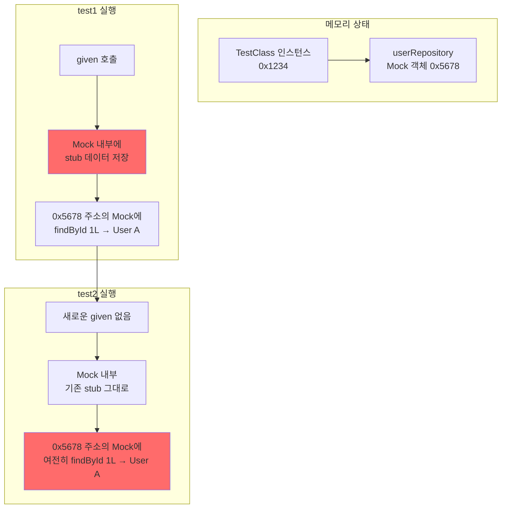

### 코드로 보는 문제

```java
// TestInstance PER_CLASS - 인스턴스 1개만!
class Test {
    // Mock - userRepository 메모리 주소: 0x5678
    UserRepository userRepository;

    // Test 1
    void test1() {
        // Mock 내부에 데이터 저장
        given(userRepository.findById(1L))
            .willReturn(Optional.of(new User("Alice")));

        // Mock 내부 상태:
        // { findById: { 1L: User("Alice") } }
    }

    // Test 2
    void test2() {
        // ❌ Mock이 초기화 안 됨!
        // Mock 내부 상태 그대로:
        // { findById: { 1L: User("Alice") } }  👈 test1 영향

        var result = userRepository.findById(1L);
        // ❌ Optional[User("Alice")] 리턴됨!
    }
}
```

### AutoMockExtension의 해결 방법

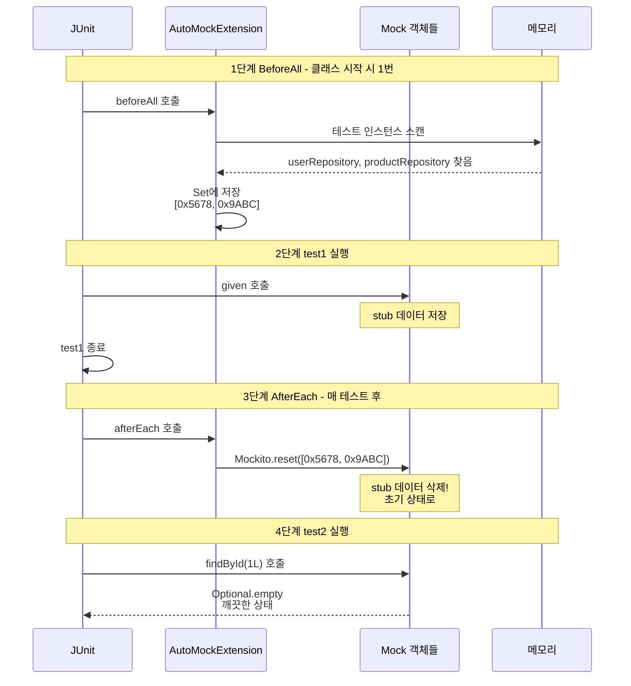

### 핵심 동작 3단계

1. **BeforeAll**: Mock 객체들의 메모리 주소를 Set에 저장
2. **AfterEach**: 저장된 Mock들에 대해 `Mockito.reset()` 호출
3. **결과**: 매 테스트마다 깨끗한 Mock 상태 유지

### 비교표

| 시점 | 기본 MockitoExtension | AutoMockExtension |
|-----|---------------------|------------------|
| 인스턴스 생성 | 매 테스트마다 | 클래스당 1번 |
| Mock 초기화 | 자동 (새 인스턴스) | BeforeAll에서 수동 |
| Mock reset | 불필요 (소멸됨) | AfterEach에서 수동 ✅ |
| PER_CLASS 지원 | ❌ | ✅ |

---

## 2. Spring 테스트 초기화 아키텍처

### Level 1: JVM 시작부터 Spring까지

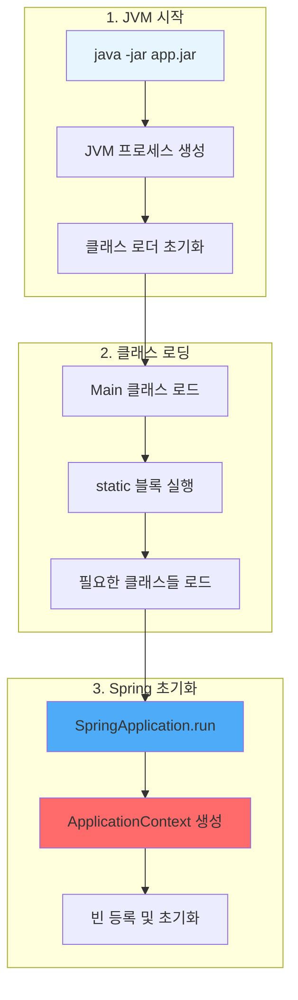

### JVM 메모리 구조

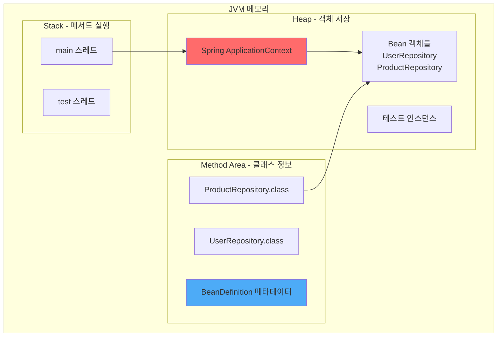

### Level 2: ApplicationContext 초기화 순서

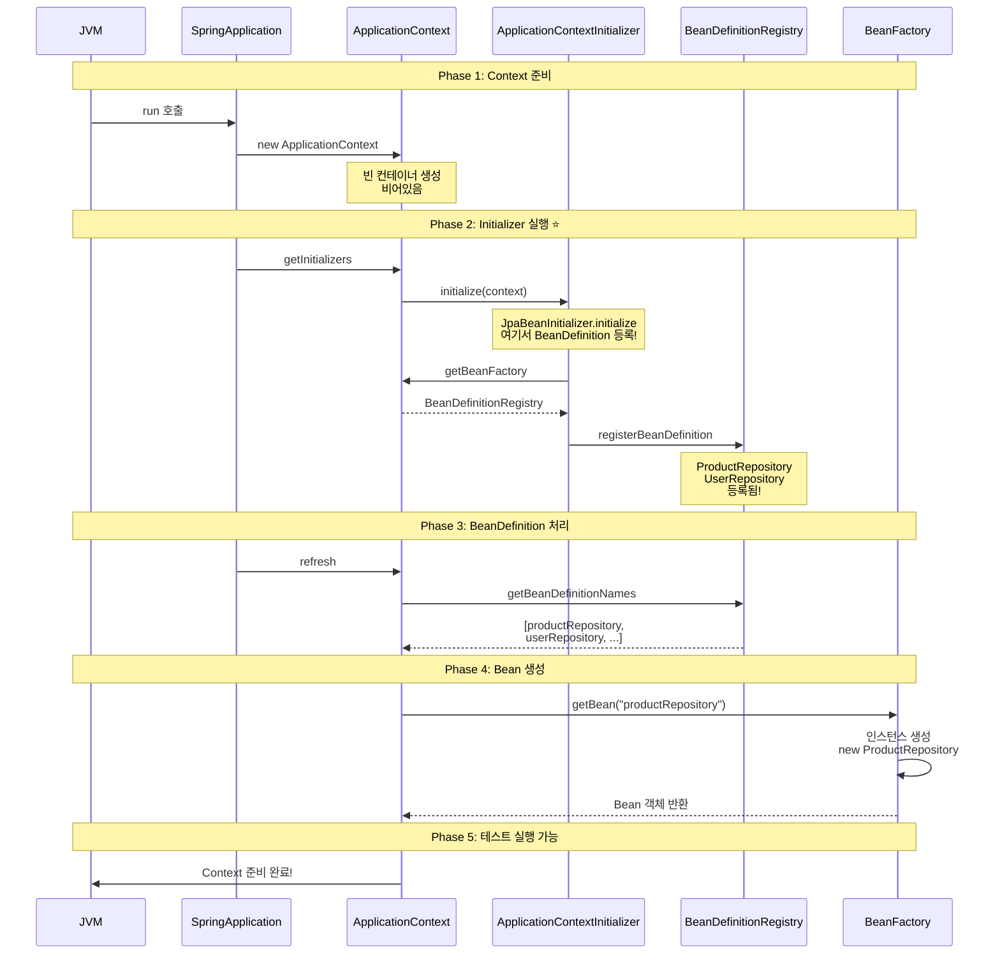

### Level 3: JpaBeanInitializer의 정확한 타이밍

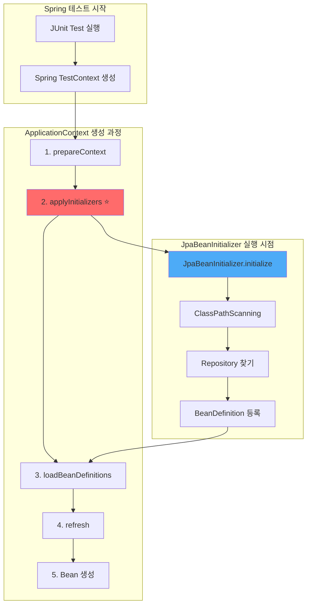

### 코드로 보는 정확한 순서

```java
// Spring TestContext 내부 (개념적 코드)
class TestContext {

    void prepareTestInstance() {
        // 1단계 ApplicationContext 생성
        ApplicationContext context = new AnnotationConfigApplicationContext();

        // 2단계 Initializer 실행 ⭐ (JpaBeanInitializer 여기서 실행!)
        applyInitializers(context);
        // → JpaBeanInitializer.initialize(context) 호출됨
        // → 이 시점에 Repository 스캔하여 BeanDefinition 등록

        // 3단계 Configuration, ComponentScan 처리
        loadBeanDefinitions(context);

        // 4단계 Context refresh (Bean 생성)
        context.refresh();
        // → 이 시점에 ProductRepository 인스턴스 생성

        // 5단계 테스트 인스턴스에 주입
        autowireTestInstance(testInstance, context);
    }
}
```

### Level 4: BeanDefinition vs Bean 인스턴스

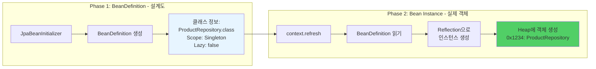

### BeanDefinition 예시 코드

```java
// BeanDefinition: "이렇게 만들어라"는 설명서
BeanDefinition def = new GenericBeanDefinition();
def.setBeanClassName("com.concurrency.shop.domain.product.ProductRepository");
def.setScope("singleton");
def.setLazyInit(false);

// Registry에 등록
registry.registerBeanDefinition("productRepository", def);

// 나중에 Context refresh 시:
// 1. BeanDefinition 읽기
// 2. Reflection으로 인스턴스 생성
Class<?> clazz = Class.forName("com.concurrency.shop.domain.product.ProductRepository");
Object instance = clazz.getDeclaredConstructor().newInstance();

// 3. Bean으로 등록
beanFactory.registerSingleton("productRepository", instance);
```

### Level 5: DataJpaTest의 특수성

```mermaid
graph TB
    subgraph "일반 SpringBootTest"
        A1[SpringBootTest] --> B1[전체 컨텍스트 로드]
        B1 --> C1[ComponentScan 실행]
        C1 --> D1[Repository 자동 스캔 ✅]
    end

    subgraph "DataJpaTest"
        A2[DataJpaTest] --> B2[JPA 관련만 로드]
        B2 --> C2[ComponentScan 비활성화]
        C2 --> D2[Repository 자동 스캔 ❌]
    end

    subgraph "JpaBeanInitializer 추가"
        A3[DataJpaTest +<br/>JpaBeanInitializer] --> B3[JPA 관련만 로드]
        B3 --> C3[Initializer가 수동 스캔]
        C3 --> D3[Repository 등록 ✅]
    end

    style D2 fill:#ff6b6b
    style D3 fill:#51cf66
```

### DataJpaTest 내부 동작

```java
// DataJpaTest 소스 코드 (일부)
// Target ElementType.TYPE
// Retention RetentionPolicy.RUNTIME
// BootstrapWith DataJpaTestContextBootstrapper.class
// ExtendWith SpringExtension.class
// OverrideAutoConfiguration enabled = false  // 👈 자동 설정 끔!
// TypeExcludeFilters DataJpaTypeExcludeFilter.class  // 👈 필터링!
// Transactional
// AutoConfigureCache
// AutoConfigureDataJpa
// AutoConfigureTestDatabase
// AutoConfigureTestEntityManager
// ImportAutoConfiguration
public @interface DataJpaTest {
```

**핵심**:
- `OverrideAutoConfiguration(enabled = false)`: 일반적인 컴포넌트 스캔 비활성화
- `TypeExcludeFilters`: JPA 관련만 포함
- **결과**: Repository가 자동으로 스캔되지 않음!

**JpaBeanInitializer의 역할**:
```java
// 비활성화된 컴포넌트 스캔을 수동으로 실행
ClassPathScanningCandidateComponentProvider scanner =
    new ClassPathScanningCandidateComponentProvider(false);

scanner.addIncludeFilter(new AnnotationTypeFilter(Repository.class));
var beans = scanner.findCandidateComponents("com.concurrency");

// 찾은 것들을 수동으로 등록
for (var bean : beans) {
    registry.registerBeanDefinition(beanName, bean);
}
```

---

## 3. Introspector 원리

### JavaBeans 명명 규칙

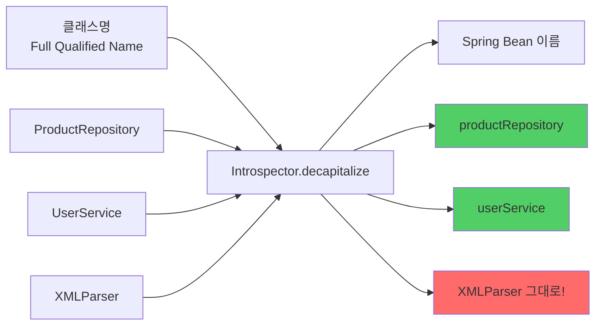

### Introspector 구현 코드

```java
// JavaBeans 규칙:
// 1. 첫 글자만 대문자 → 소문자로
// 2. 첫 두 글자가 모두 대문자 → 그대로

public class Introspector {
    public static String decapitalize(String name) {
        if (name == null || name.length() == 0) {
            return name;
        }

        // 첫 두 글자가 모두 대문자면 그대로 리턴
        if (name.length() > 1 &&
            Character.isUpperCase(name.charAt(0)) &&
            Character.isUpperCase(name.charAt(1))) {
            return name;  // XMLParser → XMLParser
        }

        // 첫 글자만 소문자로
        char chars[] = name.toCharArray();
        chars[0] = Character.toLowerCase(chars[0]);
        return new String(chars);  // ProductRepository → productRepository
    }
}
```

### 사용 예시

```java
System.out.println(Introspector.decapitalize("ProductRepository"));
// → productRepository

System.out.println(Introspector.decapitalize("UserService"));
// → userService

System.out.println(Introspector.decapitalize("XMLParser"));
// → XMLParser (변경 없음! 두 글자가 대문자)

System.out.println(Introspector.decapitalize("URL"));
// → URL (변경 없음!)

System.out.println(Introspector.decapitalize("Url"));
// → url
```

### JpaBeanInitializer에서 사용

```java
// BeanDefinition에서 클래스명 추출
String fullName = definition.getBeanClassName();
// → "com.concurrency.shop.domain.product.ProductRepository"

// 빈 이름 생성
String beanName = Introspector.decapitalize(
    fullName.substring(fullName.lastIndexOf('.') + 1)
);
// → "productRepository"

beanFactory.registerBeanDefinition(beanName, definition);
```

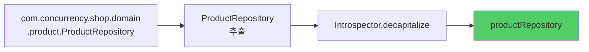

---

## 4. Future와 CompletableFuture

### Level 1: 동시성 vs 병렬성

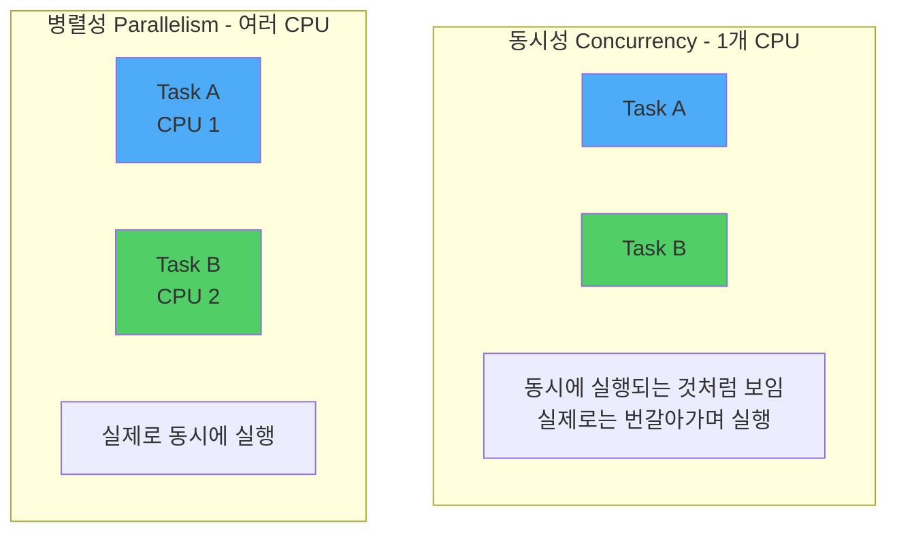

### Level 2: ExecutorService - Thread Pool

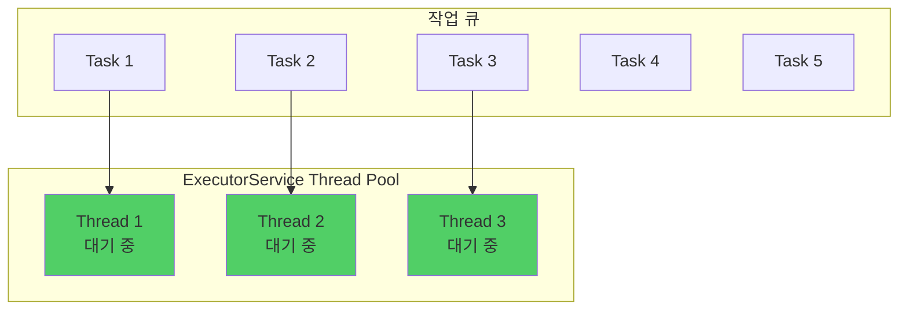

### ExecutorService 사용 예시

```java
// Thread Pool 생성 (3개 스레드)
ExecutorService executor = Executors.newFixedThreadPool(3);

// 작업 제출
for (int i = 0; i < 10; i++) {
    final int taskNum = i;
    executor.submit(() -> {
        System.out.println("Task " + taskNum + " 실행: "
            + Thread.currentThread().getName());
        Thread.sleep(1000);
    });
}

// 종료
executor.shutdown();  // 새 작업 받지 않음
executor.awaitTermination(10, TimeUnit.SECONDS);  // 완료 대기
```

### Level 3: Future - 미래의 결과

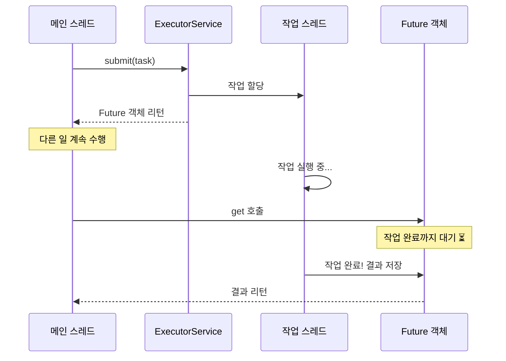

### Future 사용 예시

```java
ExecutorService executor = Executors.newFixedThreadPool(1);

// Callable: 결과를 리턴하는 작업
Callable<Integer> task = () -> {
    Thread.sleep(2000);  // 2초 작업
    return 42;
};

// Future 받기
Future<Integer> future = executor.submit(task);

System.out.println("작업 제출 완료, 다른 일 수행 가능");
// 다른 작업...

// 결과 받기 (블로킹!)
Integer result = future.get();  // 2초 대기
System.out.println("결과: " + result);  // 42

executor.shutdown();
```

### Level 4: CompletableFuture - 개선된 비동기

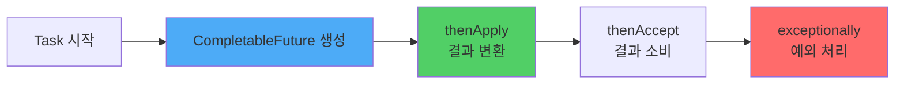

### CompletableFuture 기본 사용

```java
// 비동기 작업 시작
CompletableFuture<Integer> future = CompletableFuture.supplyAsync(() -> {
    System.out.println("작업 시작: " + Thread.currentThread().getName());
    sleep(2000);
    return 42;
});

// Callback 체이닝
future
    .thenApply(result -> result * 2)  // 42 → 84
    .thenAccept(result -> {
        System.out.println("최종 결과: " + result);  // 84
    });

System.out.println("메인 스레드는 계속 실행");
```

### 여러 Future 조합

```java
CompletableFuture<Integer> future1 = CompletableFuture.supplyAsync(() -> {
    sleep(1000);
    return 10;
});

CompletableFuture<Integer> future2 = CompletableFuture.supplyAsync(() -> {
    sleep(1000);
    return 20;
});

// 둘 다 완료될 때까지 대기
CompletableFuture<Void> combined = CompletableFuture.allOf(future1, future2);
combined.join();  // 블로킹

System.out.println("결과 1: " + future1.get());  // 10
System.out.println("결과 2: " + future2.get());  // 20
```

### Level 5: 지인 코드의 동시성 테스트 패턴

```java
// 1단계 Thread Pool 생성 (10개 스레드)
final var executor = Executors.newFixedThreadPool(10);

// 2단계 10개의 CompletableFuture 생성
var futures = IntStream.range(0, 10)
    .mapToObj(it -> CompletableFuture.runAsync(() -> {
        pointServiceV2.usePoints(userEntity.getId(), targetUsePont, targetOrderId);
    }, executor))
    .toArray(CompletableFuture[]::new);

// 3단계 모든 작업이 끝날 때까지 대기
CompletableFuture.allOf(futures).join();

// 4단계 ExecutorService 종료
executor.shutdown();
```

### 단계별 실행 흐름

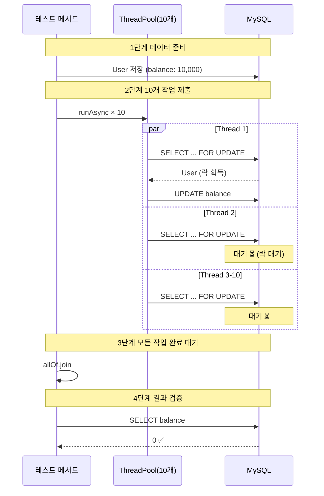

### 핵심 패턴 4가지

#### Pattern 1: runAsync - 결과 없는 비동기 실행

```java
CompletableFuture<Void> future = CompletableFuture.runAsync(() -> {
    // 리턴값 없는 작업
    pointService.usePoints(userId, 1000L);
});
```

#### Pattern 2: supplyAsync - 결과 있는 비동기 실행

```java
CompletableFuture<User> future = CompletableFuture.supplyAsync(() -> {
    // 리턴값 있는 작업
    return userRepository.findById(1L).orElseThrow();
});

User user = future.join();  // 결과 받기
```

#### Pattern 3: allOf - 여러 작업 대기

```java
CompletableFuture<Void>[] futures = IntStream.range(0, 10)
    .mapToObj(i -> CompletableFuture.runAsync(() -> {
        // 작업
    }))
    .toArray(CompletableFuture[]::new);

CompletableFuture.allOf(futures).join();  // 모두 완료 대기
```

#### Pattern 4: ExecutorService 지정

```java
ExecutorService executor = Executors.newFixedThreadPool(10);

CompletableFuture.runAsync(() -> {
    // 작업
}, executor);  // 👈 특정 ThreadPool 사용

executor.shutdown();  // 종료 필수!
```

---

## 전체 요약

### 1. AutoMockExtension 핵심


**핵심 동작**:
- `BeforeAll`: Mock 객체들을 Set에 저장
- `AfterEach`: 저장된 Mock들을 `reset()`
- 결과: 매 테스트마다 깨끗한 Mock

---

### 2. Spring 초기화 아키텍처

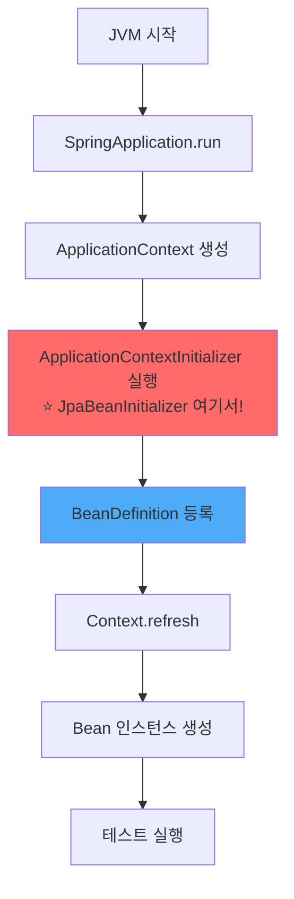

**핵심 타이밍**:
1. Context 생성 → 2. **Initializer 실행** → 3. BeanDefinition 처리 → 4. Bean 생성

---

### 3. Introspector

```java
// JavaBeans 명명 규칙 적용
Introspector.decapitalize("ProductRepository")  → "productRepository"
Introspector.decapitalize("XMLParser")           → "XMLParser" (변경 없음)

// 규칙:
// - 첫 글자만 대문자 → 소문자로
// - 첫 두 글자 모두 대문자 → 그대로
```

---

### 4. Future와 CompletableFuture

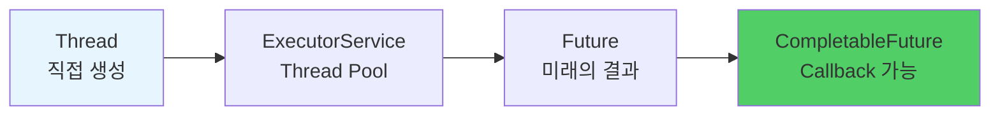

**진화 과정**:
1. `Thread`: 직접 관리 (비용 높음)
2. `ExecutorService`: Thread Pool 관리
3. `Future`: 비동기 결과 받기
4. `CompletableFuture`: Callback, 조합 가능

**동시성 테스트 핵심 패턴**:
```java
ExecutorService executor = Executors.newFixedThreadPool(10);

var futures = IntStream.range(0, 10)
    .mapToObj(i -> CompletableFuture.runAsync(() -> {
        // 동시 실행할 작업
    }, executor))
    .toArray(CompletableFuture[]::new);

CompletableFuture.allOf(futures).join();  // 모두 완료 대기
executor.shutdown();
```

---

## 참고 자료

### 관련 키워드
- ApplicationContextInitializer
- BeanDefinition vs Bean Instance
- Reflection API
- JavaBeans Specification
- Concurrency vs Parallelism
- Thread Pool Pattern
- Future Pattern
- Async/Await Pattern

### 다음 학습 주제
- CountDownLatch: 정밀한 동시 시작 제어
- CyclicBarrier: 단계별 동기화
- Pessimistic Lock 테스트
- Optimistic Lock 테스트
- 실전 동시성 시나리오

---

**작성일**: 2025-10-20
**학습 단계**: Phase 2 - 지인 방식 이해 및 심화
**다음**: CountDownLatch 및 실전 예제
