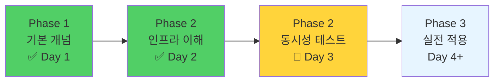

# Day 3 시작 프롬프트

## 복사해서 Claude에게 붙여넣기 👇

```
안녕! Java 테스트 코드 학습 3일차야.
어제까지 Phase 2의 인프라 이해를 끝냈고, 오늘은 Phase 2의 남은 부분인 CountDownLatch와 실전 동시성 테스트 예제를 학습하려고 해.

# Day 1-2 학습 완료 내용

## Day 1: Phase 1 - 기본 개념 ✅
- JUnit 5 생명주기 (PER_CLASS vs PER_METHOD)
- Mockito 기본 사용법 (Mock vs 실제 객체)
- Spring Boot 테스트 애노테이션 (@DataJpaTest, @SpringBootTest)
- Fixture Monkey 기본 사용법
- 테스트 DB 설정 방법 3가지 (H2, Docker, TestContainers)

## Day 2: Phase 2 - 인프라 이해 ✅

### 1. JpaBeanInitializer 원리
- ApplicationContextInitializer가 무엇인지 이해
- Spring Context 초기화 순서 (Context 생성 → Initializer 실행 → BeanDefinition 등록 → Bean 생성)
- BeanDefinition vs Bean Instance 차이
- @DataJpaTest에서 Repository 자동 등록 방법
- Introspector와 JavaBeans 명명 규칙

**핵심 인사이트**:
```java
// JpaBeanInitializer는 Context 초기화 "전"에 실행
// 1. Context 생성 → 2. Initializer → 3. BeanDefinition → 4. Bean
```

### 2. TestTransactionSupport 활용
- Transaction Propagation 개념 (REQUIRED vs REQUIRES_NEW)
- REQUIRES_NEW가 동시성 테스트에서 필요한 이유
- 동시성 테스트에서 데이터 준비 방법

**핵심 인사이트**:
```java
// REQUIRES_NEW: 새 트랜잭션 시작 → 즉시 커밋
// Worker Thread들이 데이터를 볼 수 있도록 함
testTransactionSupport.executeWithNewTx(() -> userRepository.save(user));
```

### 3. AutoMockExtension 심층 분석
- PER_CLASS에서 Mock 상태 관리 문제
- BeforeAll에서 Mock 수집, AfterEach에서 reset
- 기본 MockitoExtension과의 차이

**핵심 인사이트**:
```java
// BeforeAll: Mock들을 Set에 저장 (메모리 주소)
// AfterEach: Mockito.reset(mocks) - 매 테스트마다 초기화
```

### 4. Spring 초기화 아키텍처 심화
- JVM 메모리 구조 (Heap, Method Area, Stack)
- ApplicationContext 초기화 6단계
- Reflection API와 Bean 생성 원리

### 5. CompletableFuture와 동시성 패턴
- Thread → ExecutorService → Future → CompletableFuture 진화
- Thread Pool 개념과 사용법
- CompletableFuture 4가지 핵심 패턴 (runAsync, supplyAsync, allOf, Executor 지정)

**핵심 패턴**:
```java
// 1. ExecutorService로 Thread Pool 생성
ExecutorService executor = Executors.newFixedThreadPool(10);

// 2. CompletableFuture로 비동기 실행
var futures = IntStream.range(0, 10)
    .mapToObj(i -> CompletableFuture.runAsync(() -> {
        // 동시 실행할 작업
    }, executor))
    .toArray(CompletableFuture[]::new);

// 3. allOf로 모든 작업 완료 대기
CompletableFuture.allOf(futures).join();

// 4. ExecutorService 종료
executor.shutdown();
```

# 오늘 학습 목표 (Phase 2 남은 부분)

예상 시간: 60-90분

## 1. CountDownLatch 이해 및 실습 (20분)

### 학습 목표
- CountDownLatch가 무엇인지 이해
- CompletableFuture와의 차이점
- 왜 동시성 테스트에서 "정밀한 동시 시작"이 필요한지

### 실습
- CountDownLatch를 사용한 동시 시작 테스트 작성
- 동시 시작 vs 순차 실행 비교

### 궁금한 점
```java
// 이 패턴이 왜 필요한지 이해하고 싶어
CountDownLatch latch = new CountDownLatch(threadCount);
for (int i = 0; i < threadCount; i++) {
    executor.submit(() -> {
        latch.countDown();  // 준비 완료
        latch.await();      // 모두 준비될 때까지 대기
        // 👆 이 부분이 왜 필요한지
        pointService.usePoints(...);
    });
}
```

## 2. CyclicBarrier 이해 (선택, 10분)

- CountDownLatch vs CyclicBarrier 차이
- 재사용 가능한 동기화 도구
- 사용 시나리오

## 3. 실전 동시성 테스트 예제 (40분)

### 3-1. 포인트 따닥 방지 테스트
- Pessimistic Lock을 사용한 동시성 제어
- 락 대기 및 순차 처리 검증
- 최종 잔액 일관성 검증

### 3-2. 재고 차감 동시성 테스트
- 재고 동시 차감 시나리오
- 재고 부족 예외 처리
- 성공/실패 케이스 분리 검증

### 3-3. 실패 시나리오 검증
- 동시 요청 중 일부 실패 케이스
- 트랜잭션 롤백 확인
- 데이터 정합성 검증

## 4. 전체 정리 및 회고 (20분)

### 지인 테스트 코드 구조 전체 복습
```
support/
├── AbstractTest.java              (PER_CLASS + FixtureMonkey)
├── AbstractJpaTest.java           (@DataJpaTest)
├── AbstractIntegrationServiceTest.java  (@SpringBootTest)
├── AbstractConcurrencyTest.java   (동시성 테스트)
├── JpaBeanInitializer.java        ⭐ Day 2 학습
├── TestTransactionSupport.java    ⭐ Day 2 학습
└── AutoMockExtension.java         ⭐ Day 2 학습
```

### 나만의 테스트 전략 수립
- 언제 단위 테스트를 쓸까? (Mock)
- 언제 통합 테스트를 쓸까? (실제 DB)
- 언제 동시성 테스트를 쓸까?

# 프로젝트 정보

- **경로**: `/Users/xpmxf4/Desktop/develop/simple-project-for-test`
- **환경**: JDK 21, Spring Boot 3.2.5, MySQL 8.0 (Docker)
- **테스트 프레임워크**: JUnit 5, Mockito, Fixture Monkey 1.1.15

# 지인 테스트 코드 참고 파일

```
src/test/java/
├── support/
│   ├── AbstractConcurrencyTest.java     ⭐ 오늘 사용할 베이스 클래스
│   ├── TestTransactionSupport.java      (어제 학습 완료)
│   └── ...
└── com/concurrency/shop/service/v2/concurrency/
    └── PointServiceV2ConcurrencyTest.java  ⭐ 오늘 분석할 실전 예제
```

# 학습 스타일 요청

## 1. 탑다운 방식
- 큰 그림 먼저 보여주고 → 세부 사항으로
- "왜 필요한가?"부터 시작

## 2. 도식화 필수
- Mermaid 다이어그램으로 시각적 설명
- **중요**: Notion의 Mermaid 엔진 사용 → 노드 ID에 `@` 기호 사용 금지
  ```mermaid
  # ❌ 잘못된 예
  graph LR
      @DataJpaTest --> A

  # ✅ 올바른 예
  graph LR
      DataJpaTest --> A
  ```

## 3. 실습 중심
- 직접 따라 할 수 있는 코드 제공
- 코드는 파일 경로와 라인 번호 포함 (예: `support/AbstractConcurrencyTest.java:10`)

## 4. Insight 박스
- 핵심 설계 의도를 Insight 박스로 설명
  ```
  `★ Insight ─────────────────────────────────────`
  [2-3 key educational points]
  `─────────────────────────────────────────────────`
  ```

## 5. 비유 없이 직관적 설명
- 비유보다는 메모리 주소, 실행 순서 등 구체적 설명 선호
- 코드 실행 흐름을 단계별로

## 6. 단계별 확인
- 한 주제 끝나면 이해했는지 확인하며 진행

# 어제 복습 자료 위치

어제 학습한 내용을 복습하고 싶으면:
```
/Users/xpmxf4/Desktop/develop/simple-project-for-test/review/Day2_Phase2_복습_정리.md
```

이 파일을 읽으면 어제 학습한 내용을 상세히 복습할 수 있어.

# 요청사항

오늘은 **CountDownLatch부터 시작**해줘!

1. CountDownLatch가 무엇인지 (CompletableFuture와 비교)
2. 왜 "정밀한 동시 시작"이 필요한지
3. 실제 코드에서 어떻게 사용하는지
4. 실습 예제

도식화와 함께 탑다운 방식으로 설명 부탁해!
```

---

## 추가 팁

### 특정 주제만 복습하고 싶으면
```
어제 학습한 내용 중 [JpaBeanInitializer / TestTransactionSupport / AutoMockExtension / CompletableFuture] 부분만 복습하고 싶어.
/Users/xpmxf4/Desktop/develop/simple-project-for-test/review/Day2_Phase2_복습_정리.md 파일에서 해당 섹션만 읽고 요약해줘.
```

### CountDownLatch 전에 CompletableFuture 복습하고 싶으면
```
CountDownLatch 시작하기 전에 어제 학습한 CompletableFuture 패턴을 한 번 더 복습하고 싶어.
특히 allOf 패턴과 ExecutorService 사용법 중심으로.
```

### 실전 예제부터 바로 시작하고 싶으면
```
CountDownLatch 이론은 생략하고, PointServiceV2ConcurrencyTest.java 파일을 읽고 바로 실전 예제 분석부터 시작하고 싶어.
```

### Phase 2 전체 흐름 파악하고 싶으면
```
CountDownLatch 시작하기 전에 Phase 2 전체 흐름을 다시 한 번 정리해줘.
어제까지 뭘 배웠고, 오늘 뭘 배울 건지 큰 그림을 보고 싶어.
```

---

## 학습 진행도



**현재 위치**: Phase 2 - 동시성 테스트 패턴 학습 (CountDownLatch, 실전 예제)

---

**작성일**: 2025-10-20
**다음 학습 시간**: 60-90분
**시작 주제**: CountDownLatch 이해 및 실습
**목표**: Phase 2 완전 정복!
