# Java 테스트 코드 학습 - Day 2 복습 📚

> **작성일**: 2025-10-20
> **학습 단계**: Phase 2 - 지인 테스트 인프라 이해 및 심화
> **학습 시간**: 약 2시간
> **주요 주제**: JpaBeanInitializer, TestTransactionSupport, AutoMockExtension, Spring 초기화, Introspector, CompletableFuture

---

## 📑 목차

1. [오늘 학습한 내용 요약](#오늘-학습한-내용-요약)
2. [JpaBeanInitializer 원리](#1-jpabeannitializer-원리)
3. [TestTransactionSupport 활용](#2-testtransactionsupport-활용)
4. [AutoMockExtension 심층 분석](#3-automockextension-심층-분석)
5. [Spring 테스트 초기화 아키텍처](#4-spring-테스트-초기화-아키텍처)
6. [Introspector 원리](#5-introspector-원리)
7. [Future와 CompletableFuture](#6-future와-completablefuture)
8. [전체 요약 및 다음 학습](#전체-요약-및-다음-학습)

---

## 오늘 학습한 내용 요약

### Phase 2 목표
지인의 테스트 코드 인프라 3가지 핵심 컴포넌트 이해:
1. **JpaBeanInitializer**: `@DataJpaTest`에서 Repository 자동 등록
2. **TestTransactionSupport**: 동시성 테스트용 트랜잭션 분리
3. **AutoMockExtension**: `PER_CLASS`에서 Mock 상태 관리

### 추가 심화 학습
- Spring ApplicationContext 초기화 과정 (JVM → Context → Beans)
- Introspector와 JavaBeans 명명 규칙
- CompletableFuture를 활용한 동시성 테스트 패턴

### 학습 흐름

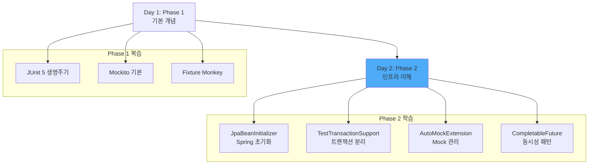

---

## 1. JpaBeanInitializer 원리

### 문제 상황

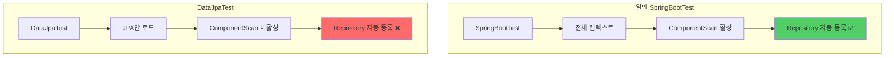

**문제**: `@DataJpaTest`는 성능을 위해 JPA 관련 컴포넌트만 로드하므로 `@Repository`가 자동으로 스캔되지 않음!

### 해결책: ApplicationContextInitializer

```java
public class JpaBeanInitializer implements ApplicationContextInitializer<ConfigurableApplicationContext> {

    @Override
    public void initialize(ConfigurableApplicationContext applicationContext) {
        // 1. BeanFactory 가져오기
        var beanFactory = (BeanDefinitionRegistry) applicationContext.getBeanFactory();

        // 2. Repository 스캐너 생성
        var beanScanner = new ClassPathScanningCandidateComponentProvider(false);
        beanScanner.addIncludeFilter(new AnnotationTypeFilter(Repository.class));

        // 3. com.concurrency 패키지에서 @Repository 찾기
        var repositoryBeans = beanScanner.findCandidateComponents("com.concurrency");

        // 4. 찾은 Repository들을 BeanDefinition으로 등록
        for (var definition : repositoryBeans) {
            var beanName = Introspector.decapitalize(definition.getBeanClassName());
            beanFactory.registerBeanDefinition(beanName, definition);
        }
    }
}
```

### 동작 흐름

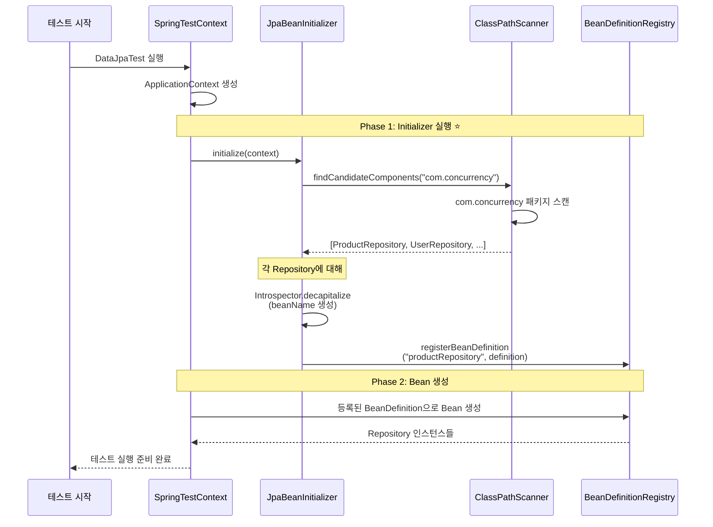

### 핵심 개념

#### ApplicationContextInitializer란?

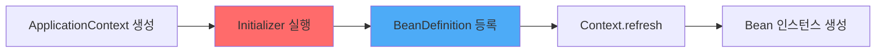

- **역할**: ApplicationContext가 완전히 초기화되기 **전**에 실행
- **타이밍**: BeanDefinition 등록 단계 (Bean 생성 이전)
- **용도**: 동적으로 Bean을 등록하거나 Context 설정 변경

#### BeanDefinition vs Bean Instance

| 항목 | BeanDefinition | Bean Instance |
|-----|---------------|---------------|
| 타이밍 | Context 초기화 전 | Context.refresh 시 |
| 내용 | "어떻게 만들까" 설계도 | 실제 생성된 객체 |
| 저장 위치 | BeanDefinitionRegistry | BeanFactory |
| 예시 | 클래스명, scope, lazy 등 | Heap 메모리의 객체 |

```java
// BeanDefinition: 설계도
BeanDefinition def = new GenericBeanDefinition();
def.setBeanClassName("com.concurrency.shop.domain.product.ProductRepository");
def.setScope("singleton");

// Bean Instance: 실제 객체 (나중에 생성됨)
ProductRepository instance = new ProductRepository(...);
```

### 실습: 새 Repository 추가 시 자동 인식

**테스트 시나리오**:
1. 새로운 `OrderRepository` 생성
2. `@Repository` 애노테이션만 추가
3. 테스트 실행 시 자동으로 Bean 등록 확인

```java
// 1. OrderRepository 생성
@Repository
public interface OrderRepository extends JpaRepository<Order, Long> {
}

// 2. 테스트에서 바로 사용 가능!
@DataJpaTest
@ContextConfiguration(initializers = JpaBeanInitializer.class)
class OrderServiceTest extends AbstractJpaTest {

    @Autowired
    private OrderRepository orderRepository;  // ✅ 자동 주입!

    @Test
    void test() {
        assertThat(orderRepository).isNotNull();
    }
}
```

---

## 2. TestTransactionSupport 활용

### 문제 상황: 동시성 테스트에서 트랜잭션 충돌

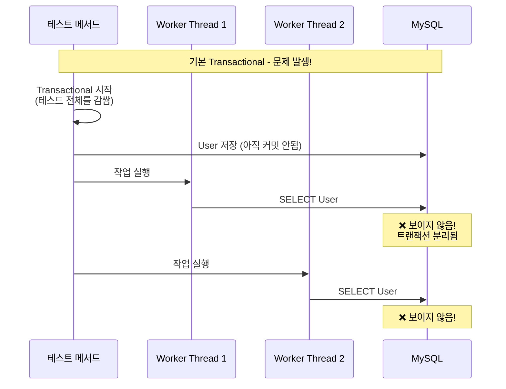

**문제**: 테스트 메서드의 `@Transactional`과 Worker Thread의 트랜잭션이 분리되어 있어 데이터를 볼 수 없음!

### 해결책: REQUIRES_NEW

```java
@TestComponent
public class TestTransactionSupport {

    // 새로운 트랜잭션으로 실행하고 즉시 커밋
    @Transactional(propagation = Propagation.REQUIRES_NEW)
    public void executeWithNewTx(Runnable runnable) {
        runnable.run();
    }

    @Transactional(propagation = Propagation.REQUIRES_NEW)
    public <T> T executeWithNewTx(Callable<T> callable) {
        try {
            return callable.call();
        } catch (Exception e) {
            throw new RuntimeException(e);
        }
    }
}
```

### Propagation.REQUIRES_NEW 동작 원리

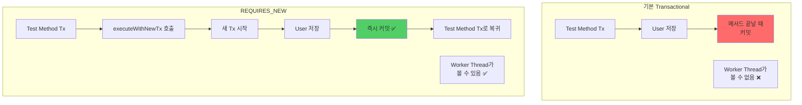

### 트랜잭션 전파 레벨 비교

| Propagation | 설명 | 사용 시나리오 |
|------------|------|-------------|
| REQUIRED (기본) | 기존 Tx 있으면 참여, 없으면 새로 생성 | 일반적인 경우 |
| REQUIRES_NEW | 항상 새 Tx 생성, 기존 Tx는 일시 중단 | 동시성 테스트 데이터 준비 ⭐ |
| MANDATORY | 반드시 기존 Tx 필요 | 독립 실행 방지 |
| NEVER | Tx 안에서 실행되면 예외 | Tx 없이 실행해야 하는 작업 |

### 실제 사용 예시

```java
@DisplayName("포인트 서비스 동시성 테스트")
class PointServiceConcurrencyTest extends AbstractConcurrencyTest {

    @Autowired
    private UserRepository userRepository;

    @Autowired
    private PointServiceV2 pointServiceV2;

    @Test
    void use_point_concurrently() {
        // given: 테스트 데이터 준비 (새 트랜잭션으로 즉시 커밋!)
        var user = fixture.giveMeBuilder(User.class)
                .setNull("id")
                .set("pointBalance", 10_000L)
                .sample();

        testTransactionSupport.executeWithNewTx(() -> userRepository.save(user));
        // ✅ 여기서 커밋됨! Worker Thread들이 볼 수 있음

        // when: 10개 스레드가 동시에 포인트 사용
        final var executor = Executors.newFixedThreadPool(10);

        var futures = IntStream.range(0, 10)
                .mapToObj(it -> CompletableFuture.runAsync(() -> {
                    pointServiceV2.usePoints(user.getId(), 1000L, 1L);
                }, executor))
                .toArray(CompletableFuture[]::new);

        CompletableFuture.allOf(futures).join();
        executor.shutdown();

        // then
        var findUser = userRepository.findById(user.getId()).orElseThrow();
        assertThat(findUser.getPointBalance()).isEqualTo(0L);
    }
}
```

### 동작 흐름 상세

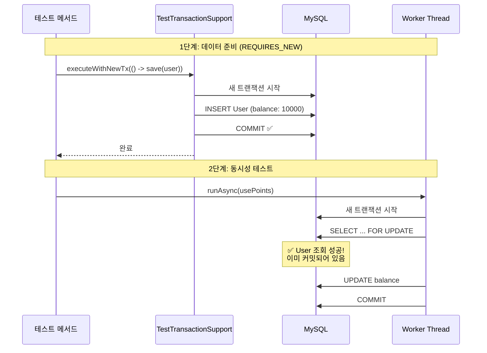

### 핵심 포인트

1. **일반 `@Transactional`**: 메서드 종료 시 커밋
2. **`REQUIRES_NEW`**: 즉시 새 트랜잭션 시작하고 완료 시 커밋
3. **동시성 테스트**: Worker Thread들이 데이터를 보려면 **미리 커밋** 필요
4. **사용처**: `AbstractConcurrencyTest`에서 `testTransactionSupport` 필드로 제공

---

## 3. AutoMockExtension 심층 분석

### 문제 상황

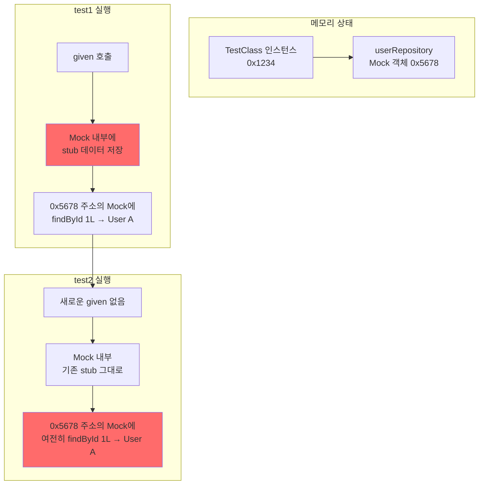

**문제**: `@TestInstance(PER_CLASS)`에서는 테스트 클래스 인스턴스가 1개만 생성되므로, Mock 객체도 1개만 존재. 이전 테스트의 stub 데이터가 다음 테스트에 영향을 줌!

### 코드로 보는 문제

```java
// TestInstance PER_CLASS - 인스턴스 1개만!
@TestInstance(Lifecycle.PER_CLASS)
class Test {
    // Mock - userRepository 메모리 주소: 0x5678
    @Mock
    UserRepository userRepository;

    // Test 1
    @Test
    void test1() {
        // Mock 내부에 데이터 저장
        given(userRepository.findById(1L))
            .willReturn(Optional.of(new User("Alice")));

        // Mock 내부 상태:
        // { findById: { 1L: User("Alice") } }
    }

    // Test 2
    @Test
    void test2() {
        // ❌ Mock이 초기화 안 됨!
        // Mock 내부 상태 그대로:
        // { findById: { 1L: User("Alice") } }  👈 test1 영향

        var result = userRepository.findById(1L);
        // ❌ Optional[User("Alice")] 리턴됨!
    }
}
```

### AutoMockExtension 해결 방법

```java
public class AutoMockExtension implements BeforeAllCallback, AfterAllCallback, AfterEachCallback {

    private final static ExtensionContext.Namespace MOCKITO = create("org.mockito");
    private final static String SESSION = "session", MOCKS = "mocks";

    @Override
    public void beforeAll(ExtensionContext context) {
        var testInstance = context.getRequiredTestInstance();

        // 1. MockitoSession 시작
        MockitoSession session = Mockito.mockitoSession()
                .initMocks(testInstance)
                .startMocking();

        // 2. 테스트 인스턴스의 모든 필드 스캔
        var mockSet = new HashSet<>();
        var fields = testInstance.getClass().getDeclaredFields();

        for (var field : fields) {
            field.setAccessible(true);
            var extractField = field.get(testInstance);

            // 3. Mock이나 Spy인지 확인
            if (Mockito.mockingDetails(extractField).isMock() ||
                Mockito.mockingDetails(extractField).isSpy()) {
                mockSet.add(extractField);  // 👈 Set에 저장!
            }
        }

        // 4. ExtensionContext에 저장
        context.getStore(MOCKITO).put(MOCKS, mockSet);
        context.getStore(MOCKITO).put(SESSION, session);
    }

    @Override
    public void afterEach(ExtensionContext context) {
        // 5. 매 테스트 후 저장된 Mock들을 reset!
        var mocks = context.getStore(MOCKITO).get(MOCKS, Set.class);
        Mockito.reset(mocks.toArray());  // ✅ 초기화!
    }

    @Override
    public void afterAll(ExtensionContext context) {
        // 6. 모든 테스트 종료 후 정리
        context.getStore(MOCKITO).remove(MOCKS, Set.class);
        context.getStore(MOCKITO).remove(SESSION, MockitoSession.class)
                .finishMocking(context.getExecutionException().orElse(null));
    }
}
```

### 동작 흐름

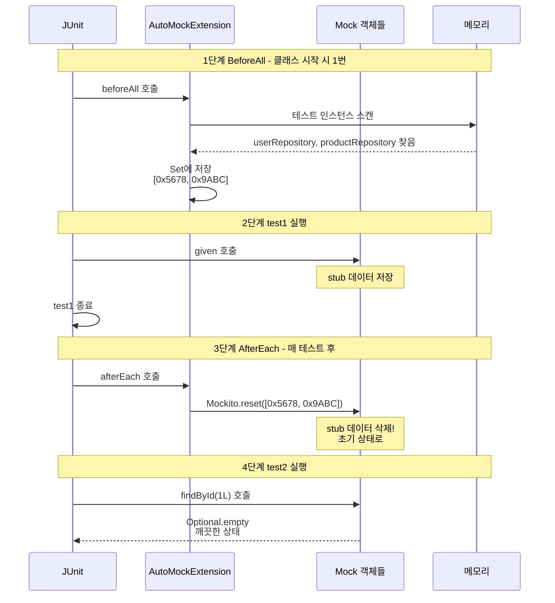

### 핵심 동작 3단계

1. **BeforeAll**:
   - 테스트 인스턴스의 모든 필드 스캔
   - Mock/Spy 객체들의 메모리 주소를 Set에 저장

2. **AfterEach**:
   - 저장된 Mock들에 대해 `Mockito.reset()` 호출
   - stub 데이터 초기화

3. **결과**:
   - 매 테스트마다 깨끗한 Mock 상태 유지
   - PER_CLASS의 성능 이점 + 테스트 격리 보장

### 기본 MockitoExtension과 비교

| 시점 | 기본 MockitoExtension | AutoMockExtension |
|-----|---------------------|------------------|
| 인스턴스 생성 | 매 테스트마다 | 클래스당 1번 |
| Mock 초기화 | 자동 (새 인스턴스) | BeforeAll에서 수동 |
| Mock reset | 불필요 (소멸됨) | AfterEach에서 수동 ✅ |
| PER_CLASS 지원 | ❌ | ✅ |
| 성능 | 느림 (인스턴스 생성 비용) | 빠름 |

---

## 4. Spring 테스트 초기화 아키텍처

### Level 1: JVM 시작부터 Spring까지

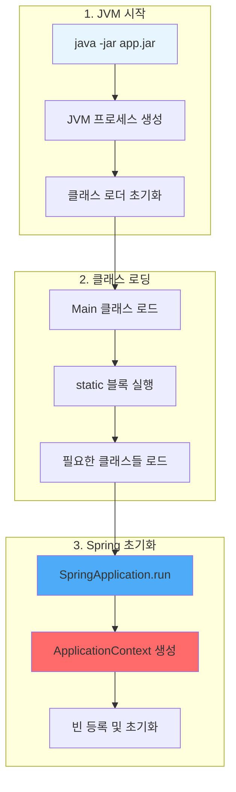

### JVM 메모리 구조

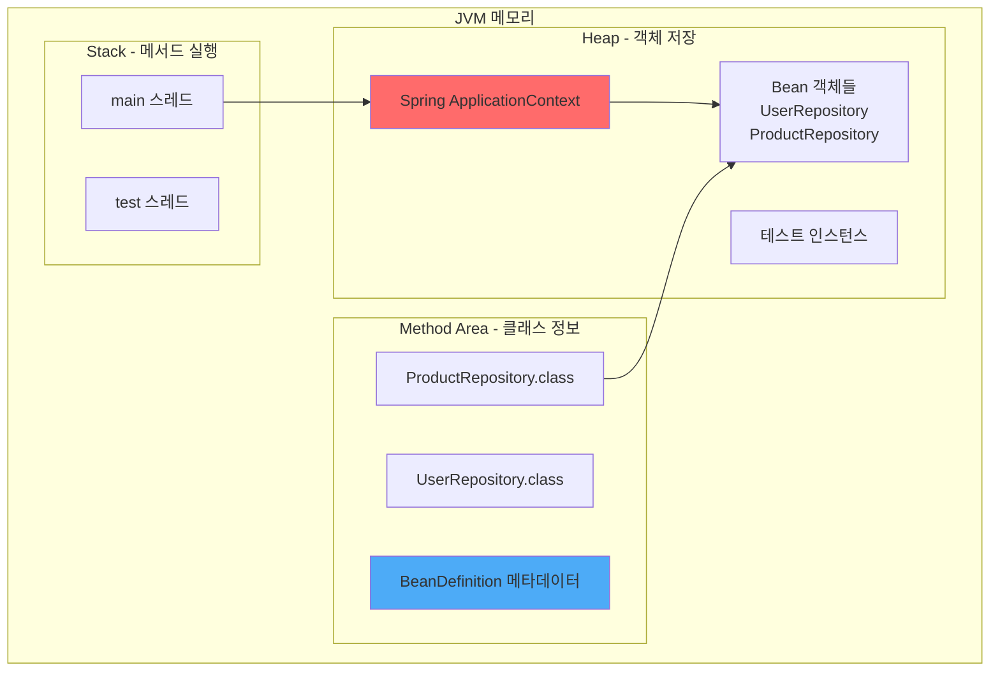

**핵심**:
- **Heap**: 실제 Bean 객체들이 생성되는 곳
- **Method Area**: 클래스 정보와 BeanDefinition 메타데이터
- **Stack**: 각 스레드의 메서드 실행 정보

### Level 2: ApplicationContext 초기화 순서

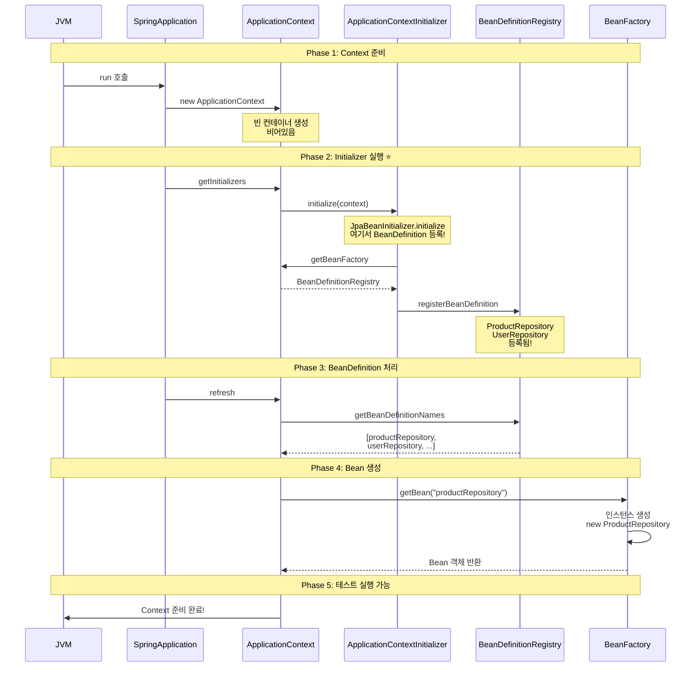

### Level 3: JpaBeanInitializer의 정확한 타이밍

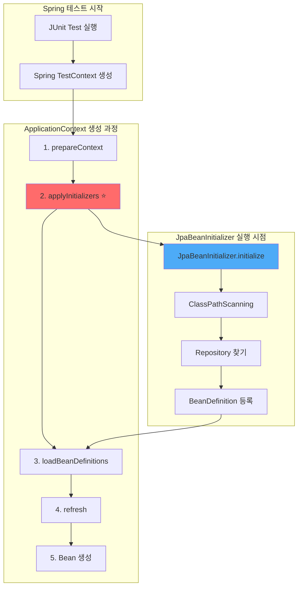

### 코드로 보는 정확한 순서

```java
// Spring TestContext 내부 (개념적 코드)
class TestContext {

    void prepareTestInstance() {
        // 1단계 ApplicationContext 생성
        ApplicationContext context = new AnnotationConfigApplicationContext();

        // 2단계 Initializer 실행 ⭐ (JpaBeanInitializer 여기서 실행!)
        applyInitializers(context);
        // → JpaBeanInitializer.initialize(context) 호출됨
        // → 이 시점에 Repository 스캔하여 BeanDefinition 등록

        // 3단계 Configuration, ComponentScan 처리
        loadBeanDefinitions(context);

        // 4단계 Context refresh (Bean 생성)
        context.refresh();
        // → 이 시점에 ProductRepository 인스턴스 생성

        // 5단계 테스트 인스턴스에 주입
        autowireTestInstance(testInstance, context);
    }
}
```

### Level 4: BeanDefinition vs Bean 인스턴스

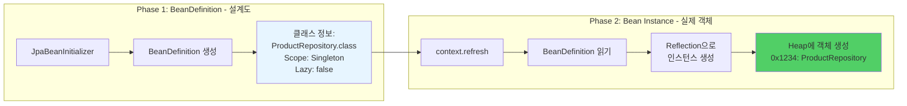

**BeanDefinition 예시 코드**:

```java
// BeanDefinition: "이렇게 만들어라"는 설명서
BeanDefinition def = new GenericBeanDefinition();
def.setBeanClassName("com.concurrency.shop.domain.product.ProductRepository");
def.setScope("singleton");
def.setLazyInit(false);

// Registry에 등록
registry.registerBeanDefinition("productRepository", def);

// 나중에 Context refresh 시:
// 1. BeanDefinition 읽기
// 2. Reflection으로 인스턴스 생성
Class<?> clazz = Class.forName("com.concurrency.shop.domain.product.ProductRepository");
Object instance = clazz.getDeclaredConstructor().newInstance();

// 3. Bean으로 등록
beanFactory.registerSingleton("productRepository", instance);
```

### Level 5: @DataJpaTest의 특수성

```mermaid
graph TB
    subgraph "일반 SpringBootTest"
        A1[SpringBootTest] --> B1[전체 컨텍스트 로드]
        B1 --> C1[ComponentScan 실행]
        C1 --> D1[Repository 자동 스캔 ✅]
    end

    subgraph "DataJpaTest"
        A2[DataJpaTest] --> B2[JPA 관련만 로드]
        B2 --> C2[ComponentScan 비활성화]
        C2 --> D2[Repository 자동 스캔 ❌]
    end

    subgraph "JpaBeanInitializer 추가"
        A3[DataJpaTest +<br/>JpaBeanInitializer] --> B3[JPA 관련만 로드]
        B3 --> C3[Initializer가 수동 스캔]
        C3 --> D3[Repository 등록 ✅]
    end

    style D2 fill:#ff6b6b
    style D3 fill:#51cf66
```

**DataJpaTest 내부 동작**:

```java
// @DataJpaTest 애노테이션 정의
@OverrideAutoConfiguration(enabled = false)  // 👈 자동 설정 끔!
@TypeExcludeFilters(DataJpaTypeExcludeFilter.class)  // 👈 필터링!
@Transactional
@AutoConfigureDataJpa
public @interface DataJpaTest {
}
```

**핵심**:
- `OverrideAutoConfiguration(enabled = false)`: 일반적인 컴포넌트 스캔 비활성화
- `TypeExcludeFilters`: JPA 관련만 포함
- **결과**: Repository가 자동으로 스캔되지 않음!

**JpaBeanInitializer의 역할**:
```java
// 비활성화된 컴포넌트 스캔을 수동으로 실행
ClassPathScanningCandidateComponentProvider scanner =
    new ClassPathScanningCandidateComponentProvider(false);

scanner.addIncludeFilter(new AnnotationTypeFilter(Repository.class));
var beans = scanner.findCandidateComponents("com.concurrency");

// 찾은 것들을 수동으로 등록
for (var bean : beans) {
    registry.registerBeanDefinition(beanName, bean);
}
```

---

## 5. Introspector 원리

### JavaBeans 명명 규칙

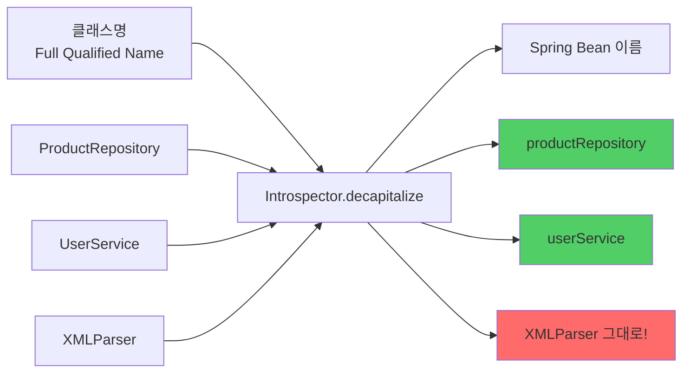

### Introspector 구현 코드

```java
// JavaBeans 규칙:
// 1. 첫 글자만 대문자 → 소문자로
// 2. 첫 두 글자가 모두 대문자 → 그대로

public class Introspector {
    public static String decapitalize(String name) {
        if (name == null || name.length() == 0) {
            return name;
        }

        // 첫 두 글자가 모두 대문자면 그대로 리턴
        if (name.length() > 1 &&
            Character.isUpperCase(name.charAt(0)) &&
            Character.isUpperCase(name.charAt(1))) {
            return name;  // XMLParser → XMLParser
        }

        // 첫 글자만 소문자로
        char chars[] = name.toCharArray();
        chars[0] = Character.toLowerCase(chars[0]);
        return new String(chars);  // ProductRepository → productRepository
    }
}
```

### 사용 예시

```java
System.out.println(Introspector.decapitalize("ProductRepository"));
// → productRepository

System.out.println(Introspector.decapitalize("UserService"));
// → userService

System.out.println(Introspector.decapitalize("XMLParser"));
// → XMLParser (변경 없음! 두 글자가 대문자)

System.out.println(Introspector.decapitalize("URL"));
// → URL (변경 없음!)

System.out.println(Introspector.decapitalize("Url"));
// → url
```

### JpaBeanInitializer에서 사용

```java
// BeanDefinition에서 클래스명 추출
String fullName = definition.getBeanClassName();
// → "com.concurrency.shop.domain.product.ProductRepository"

// 빈 이름 생성
String beanName = Introspector.decapitalize(
    fullName.substring(fullName.lastIndexOf('.') + 1)
);
// → "productRepository"

beanFactory.registerBeanDefinition(beanName, definition);
```

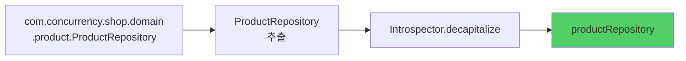

### 왜 Introspector를 사용하는가?

1. **JavaBeans 표준 준수**: Spring은 JavaBeans 스펙을 따름
2. **일관성**: 모든 Bean 이름이 동일한 규칙으로 생성됨
3. **예외 케이스 처리**: XML, URL 같은 약어도 올바르게 처리

---

## 6. Future와 CompletableFuture

### Level 1: 동시성 vs 병렬성

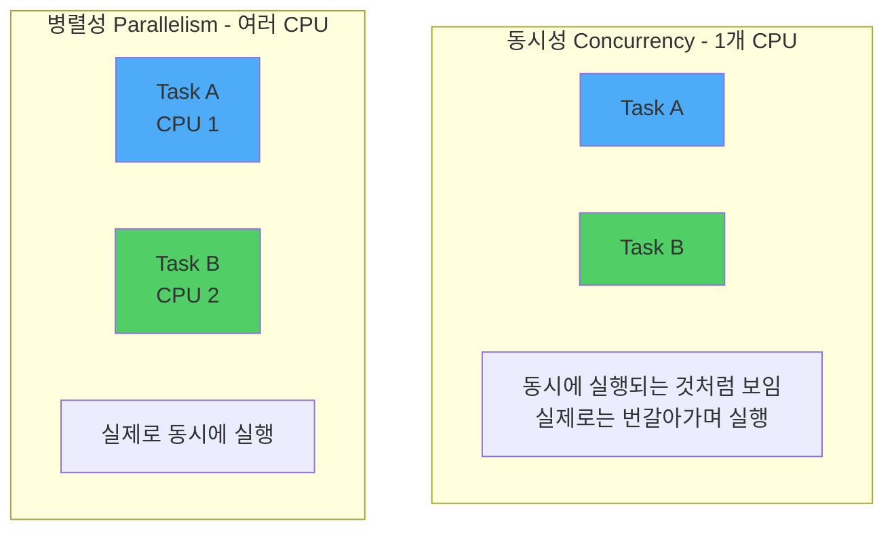

**핵심 차이**:
- **동시성 (Concurrency)**: 여러 작업이 동시에 진행되는 것처럼 보이지만, 실제로는 시간을 나눠서 번갈아가며 실행 (Context Switching)
- **병렬성 (Parallelism)**: 여러 CPU 코어에서 실제로 동시에 실행

### Level 2: Thread의 진화

#### 1단계: Thread 직접 생성 (옛날 방식)

```java
Thread thread1 = new Thread(() -> {
    System.out.println("작업 1 실행");
});

Thread thread2 = new Thread(() -> {
    System.out.println("작업 2 실행");
});

thread1.start();
thread2.start();

thread1.join();  // 완료 대기
thread2.join();
```

**문제점**:
- Thread 생성 비용이 큼
- Thread 수 제어 어려움
- 결과 받기 어려움

#### 2단계: ExecutorService - Thread Pool

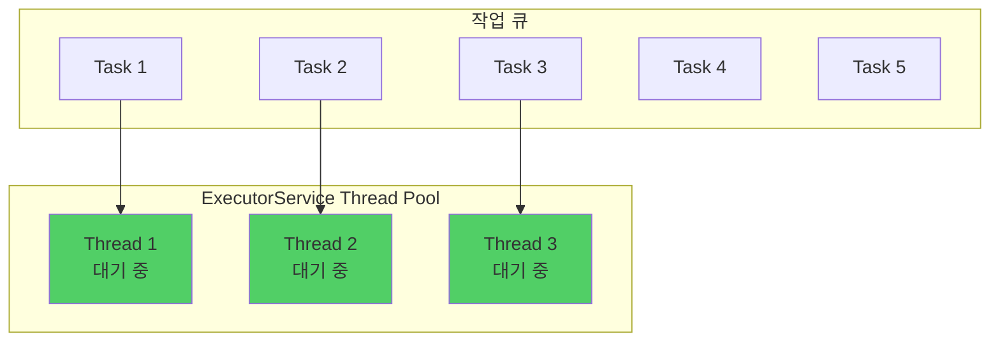

```java
// Thread Pool 생성 (3개 스레드)
ExecutorService executor = Executors.newFixedThreadPool(3);

// 작업 제출
for (int i = 0; i < 10; i++) {
    final int taskNum = i;
    executor.submit(() -> {
        System.out.println("Task " + taskNum + " 실행: "
            + Thread.currentThread().getName());
        Thread.sleep(1000);
    });
}

// 종료
executor.shutdown();  // 새 작업 받지 않음
executor.awaitTermination(10, TimeUnit.SECONDS);  // 완료 대기
```

**장점**:
- Thread 재사용 (생성 비용 절감)
- Thread 수 제어 가능
- 작업 큐로 관리

#### 3단계: Future - 미래의 결과

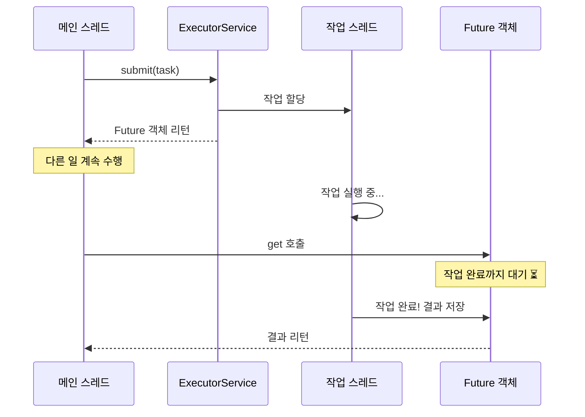

```java
ExecutorService executor = Executors.newFixedThreadPool(1);

// Callable: 결과를 리턴하는 작업
Callable<Integer> task = () -> {
    Thread.sleep(2000);  // 2초 작업
    return 42;
};

// Future 받기
Future<Integer> future = executor.submit(task);

System.out.println("작업 제출 완료, 다른 일 수행 가능");
// 다른 작업...

// 결과 받기 (블로킹!)
Integer result = future.get();  // 2초 대기
System.out.println("결과: " + result);  // 42

executor.shutdown();
```

**문제점**:
- `get()` 호출 시 블로킹됨
- Callback 지원 안 함
- 여러 Future 조합 어려움

#### 4단계: CompletableFuture - 개선된 비동기

```mermaid
graph LR
    A[Task 시작] --> B[CompletableFuture 생성]
    B --> C[thenApply<br/>결과 변환]
    C --> D[thenAccept<br/>결과 소비]
    D --> E[exceptionally<br/>예외 처리]

    style B fill:#4dabf7
    style C fill:#51cf66
    style E fill:#ff6b6b
```

```java
// 비동기 작업 시작
CompletableFuture<Integer> future = CompletableFuture.supplyAsync(() -> {
    System.out.println("작업 시작: " + Thread.currentThread().getName());
    sleep(2000);
    return 42;
});

// Callback 체이닝
future
    .thenApply(result -> result * 2)  // 42 → 84
    .thenAccept(result -> {
        System.out.println("최종 결과: " + result);  // 84
    });

System.out.println("메인 스레드는 계속 실행");
```

### 여러 Future 조합

```java
CompletableFuture<Integer> future1 = CompletableFuture.supplyAsync(() -> {
    sleep(1000);
    return 10;
});

CompletableFuture<Integer> future2 = CompletableFuture.supplyAsync(() -> {
    sleep(1000);
    return 20;
});

// 둘 다 완료될 때까지 대기
CompletableFuture<Void> combined = CompletableFuture.allOf(future1, future2);
combined.join();  // 블로킹

System.out.println("결과 1: " + future1.get());  // 10
System.out.println("결과 2: " + future2.get());  // 20
```

### Level 3: 지인 코드의 동시성 테스트 패턴

```java
// 1단계 Thread Pool 생성 (10개 스레드)
final var executor = Executors.newFixedThreadPool(10);

// 2단계 10개의 CompletableFuture 생성
var futures = IntStream.range(0, 10)
    .mapToObj(it -> CompletableFuture.runAsync(() -> {
        pointServiceV2.usePoints(userEntity.getId(), targetUsePont, targetOrderId);
    }, executor))
    .toArray(CompletableFuture[]::new);

// 3단계 모든 작업이 끝날 때까지 대기
CompletableFuture.allOf(futures).join();

// 4단계 ExecutorService 종료
executor.shutdown();
```

### 단계별 실행 흐름

```mermaid
sequenceDiagram
    participant Test as 테스트 메서드
    participant Executor as ThreadPool(10개)
    participant DB as MySQL

    Note over Test,DB: 1단계 데이터 준비
    Test->>DB: User 저장 (balance: 10,000)

    Note over Test,DB: 2단계 10개 작업 제출
    Test->>Executor: runAsync × 10

    par Thread 1
        Executor->>DB: SELECT ... FOR UPDATE
        DB-->>Executor: User (락 획득)
        Executor->>DB: UPDATE balance
    and Thread 2
        Executor->>DB: SELECT ... FOR UPDATE
        Note over DB: 대기 ⏳ (락 대기)
    and Thread 3-10
        Executor->>DB: SELECT ... FOR UPDATE
        Note over DB: 대기 ⏳
    end

    Note over Test,DB: 3단계 모든 작업 완료 대기
    Test->>Test: allOf.join

    Note over Test,DB: 4단계 결과 검증
    Test->>DB: SELECT balance
    DB-->>Test: 0 ✅
```

### 핵심 패턴 4가지

#### Pattern 1: runAsync - 결과 없는 비동기 실행

```java
CompletableFuture<Void> future = CompletableFuture.runAsync(() -> {
    // 리턴값 없는 작업
    pointService.usePoints(userId, 1000L);
});
```

#### Pattern 2: supplyAsync - 결과 있는 비동기 실행

```java
CompletableFuture<User> future = CompletableFuture.supplyAsync(() -> {
    // 리턴값 있는 작업
    return userRepository.findById(1L).orElseThrow();
});

User user = future.join();  // 결과 받기
```

#### Pattern 3: allOf - 여러 작업 대기

```java
CompletableFuture<Void>[] futures = IntStream.range(0, 10)
    .mapToObj(i -> CompletableFuture.runAsync(() -> {
        // 작업
    }))
    .toArray(CompletableFuture[]::new);

CompletableFuture.allOf(futures).join();  // 모두 완료 대기
```

#### Pattern 4: ExecutorService 지정

```java
ExecutorService executor = Executors.newFixedThreadPool(10);

CompletableFuture.runAsync(() -> {
    // 작업
}, executor);  // 👈 특정 ThreadPool 사용

executor.shutdown();  // 종료 필수!
```

---

## 전체 요약 및 다음 학습

### 오늘 학습한 핵심 개념

#### 1. JpaBeanInitializer

```mermaid
graph LR
    A[DataJpaTest] --> B[ComponentScan 비활성]
    B --> C[JpaBeanInitializer]
    C --> D[Repository 수동 스캔]
    D --> E[BeanDefinition 등록]

    style C fill:#ff6b6b
```

**핵심**:
- ApplicationContextInitializer로 Context 초기화 전에 실행
- BeanDefinition 등록 → Bean Instance 생성 순서
- Introspector로 JavaBeans 규칙 적용

#### 2. TestTransactionSupport

```mermaid
graph LR
    A[테스트 데이터 준비] --> B[REQUIRES_NEW]
    B --> C[즉시 커밋]
    C --> D[Worker Thread에서<br/>데이터 접근 가능]

    style B fill:#ff6b6b
```

**핵심**:
- REQUIRES_NEW로 새 트랜잭션 시작 및 즉시 커밋
- 동시성 테스트에서 Worker Thread들이 데이터를 볼 수 있도록 함

#### 3. AutoMockExtension

```mermaid
graph LR
    A[PER_CLASS] --> B[Mock 1개]
    B --> C[afterEach에서<br/>reset]
    C --> D[테스트 격리 보장]

    style C fill:#ff6b6b
```

**핵심**:
- BeforeAll에서 Mock 객체들을 Set에 저장
- AfterEach에서 Mockito.reset() 호출
- 성능 + 테스트 격리 양립

#### 4. CompletableFuture

```mermaid
graph LR
    A[Thread] --> B[ExecutorService]
    B --> C[Future]
    C --> D[CompletableFuture]

    style D fill:#51cf66
```

**핵심**:
- Thread Pool로 Thread 재사용
- CompletableFuture로 Callback 체이닝
- allOf로 여러 작업 대기

### 학습 진행도

```mermaid
graph LR
    A[Phase 1<br/>기본 개념 ✅] --> B[Phase 2<br/>인프라 이해 ✅]
    B --> C[Phase 2 남은 부분<br/>CountDownLatch<br/>실전 예제]

    style A fill:#51cf66
    style B fill:#51cf66
    style C fill:#ffd43b
```

### 다음 학습 주제 (Phase 2 남은 부분)

#### 1. CountDownLatch - 정밀한 동시 시작 제어 (15분)

```java
// 모든 스레드가 준비될 때까지 대기 후 동시 시작
CountDownLatch latch = new CountDownLatch(10);

for (int i = 0; i < 10; i++) {
    executor.submit(() -> {
        latch.countDown();  // 준비 완료 신호
        latch.await();      // 모두 준비될 때까지 대기
        // 여기서 동시에 시작!
        pointService.usePoints(...);
    });
}
```

#### 2. 실전 동시성 테스트 예제 (30분)

- 포인트 따닥 방지 테스트
- 재고 차감 동시성 테스트
- 실패 시나리오 검증
- Pessimistic Lock 테스트

#### 3. 전체 정리 및 리팩토링 (15분)

- 지인 테스트 코드 구조 전체 복습
- 나만의 테스트 인프라 설계 연습

### 관련 키워드

- ApplicationContextInitializer
- BeanDefinition vs Bean Instance
- Reflection API
- JavaBeans Specification
- Transaction Propagation (REQUIRES_NEW)
- TestInstance Lifecycle (PER_CLASS)
- Mock Lifecycle Management
- Concurrency vs Parallelism
- Thread Pool Pattern
- Future Pattern
- CompletableFuture Callback

---

## 참고 파일 위치

```
src/test/java/
├── support/
│   ├── JpaBeanInitializer.java          ⭐ Context 초기화
│   ├── TestTransactionSupport.java      ⭐ 트랜잭션 분리
│   ├── AutoMockExtension.java           ⭐ Mock 관리
│   ├── AbstractTest.java
│   ├── AbstractJpaTest.java
│   ├── AbstractIntegrationServiceTest.java
│   └── AbstractConcurrencyTest.java     ⭐ 다음 학습
└── com/concurrency/shop/service/v2/concurrency/
    └── PointServiceV2ConcurrencyTest.java ⭐ 실전 예제
```

---

**작성일**: 2025-10-20
**다음 학습**: Phase 2 남은 부분 - CountDownLatch 및 실전 예제
**예상 시간**: 60분
