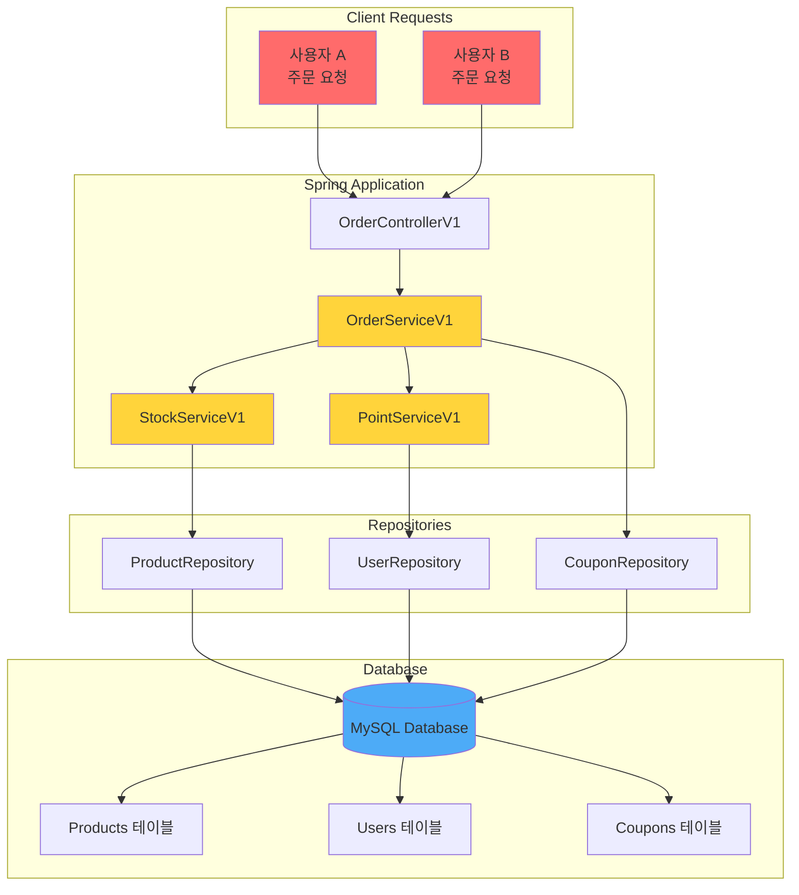
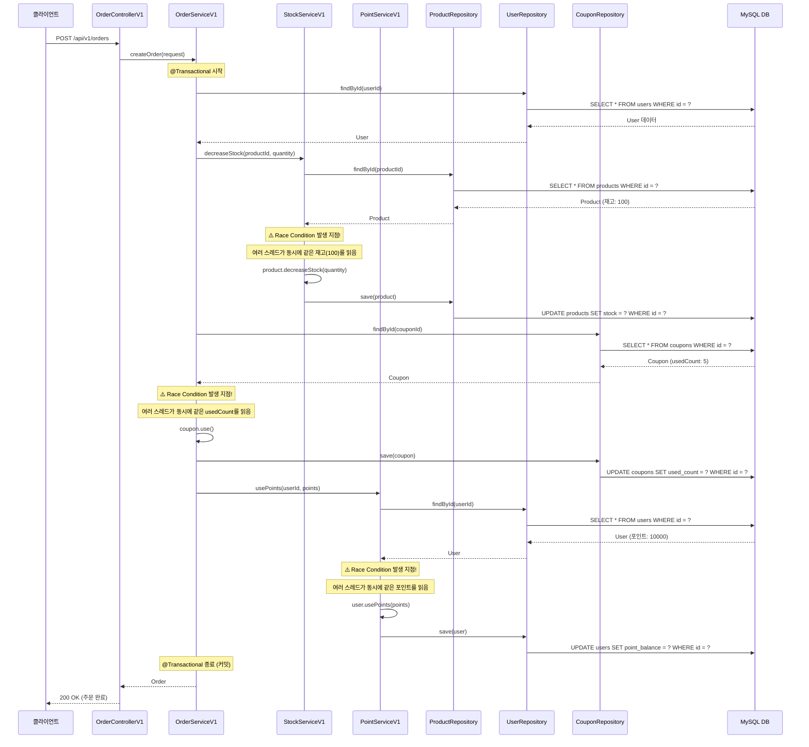
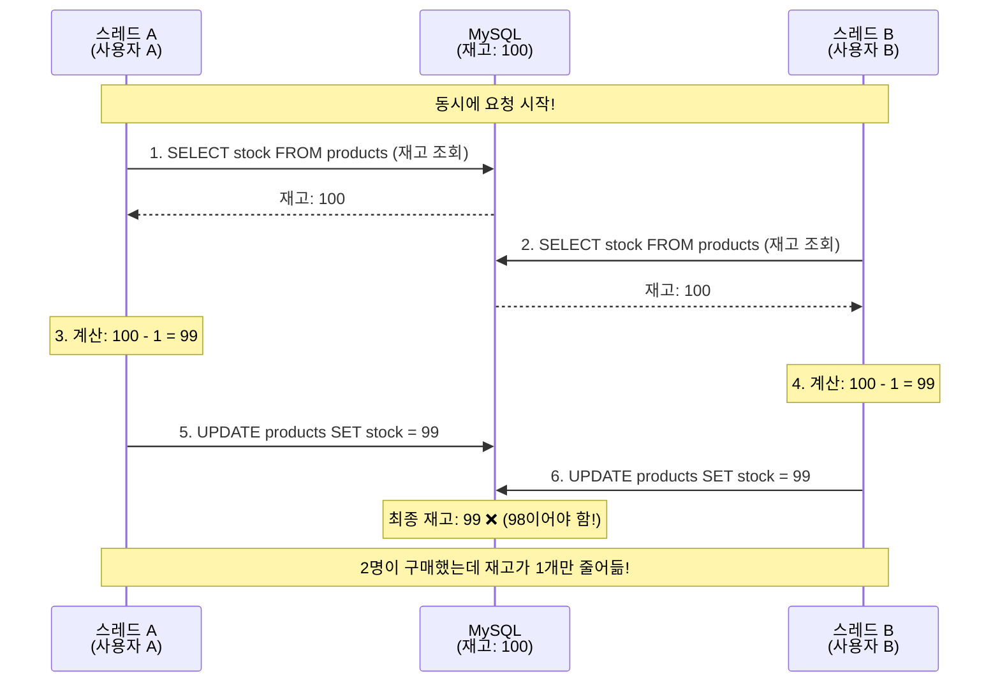
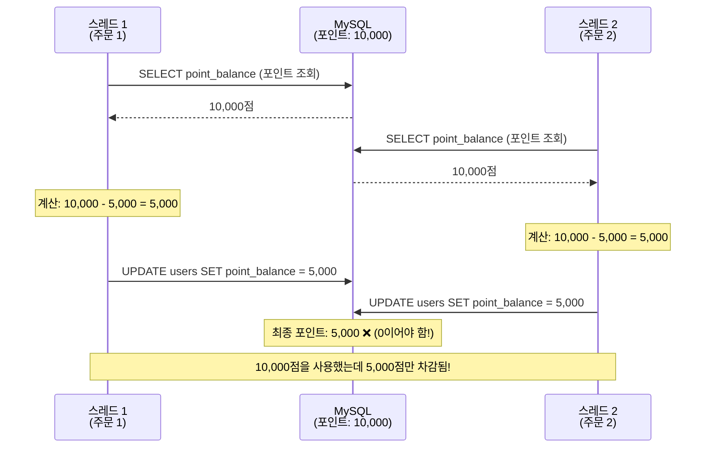
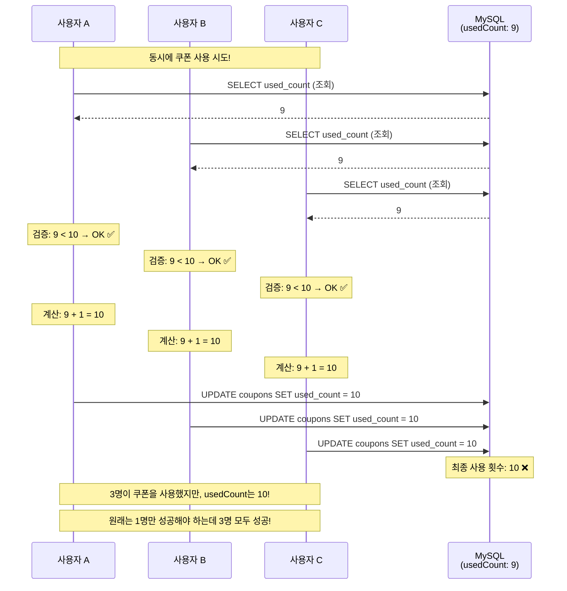
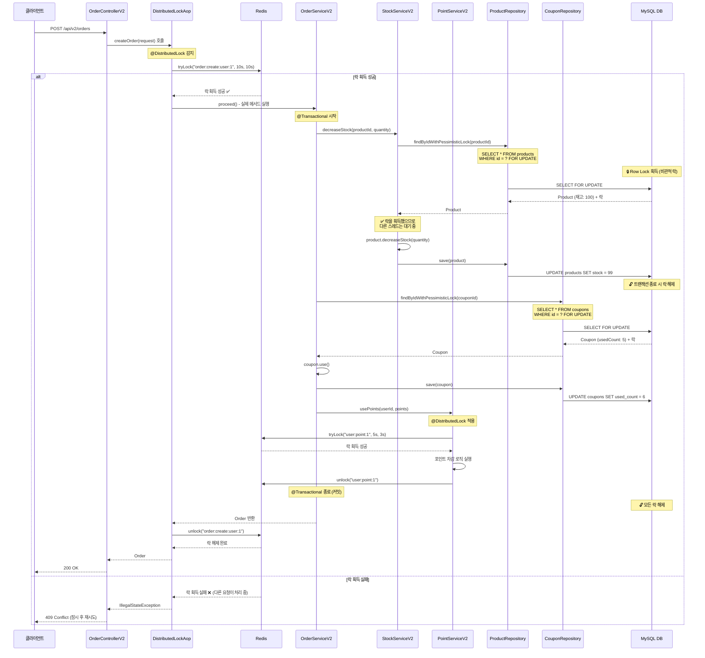

# 동시성 이슈 완벽 가이드: V1 vs V2 비교 분석

## 목차
1. [개요](#개요)
2. [동시성 기초 개념](#동시성-기초-개념)
3. [Java 동시성 메커니즘](#java-동시성-메커니즘)
4. [Redis 기초 및 분산 락](#redis-기초-및-분산-락)
5. [V1: 동시성 문제가 있는 버전](#v1-동시성-문제가-있는-버전)
6. [동시성 이슈 발생 원인](#동시성-이슈-발생-원인)
7. [V2: 동시성 문제를 해결한 버전](#v2-동시성-문제를-해결한-버전)
8. [코드별 상세 분석](#코드별-상세-분석)
9. [결론](#결론)

---

## 개요

이 프로젝트는 온라인 쇼핑몰의 주문 시스템을 구현하며, **동시성 이슈**를 다루는 두 가지 버전을 제공합니다:

- **V1**: 동시성 처리가 없는 버전 (문제 발생)
- **V2**: Redis 분산 락과 비관적 락을 사용한 동시성 처리 버전 (문제 해결)

### 주요 기능
- 상품 재고 관리
- 사용자 포인트 관리
- 쿠폰 사용 횟수 관리
- 주문 생성 및 취소

---

## 동시성 기초 개념

### 동시성이란?

**동시성(Concurrency)**은 여러 작업이 동시에 실행되는 것처럼 보이는 상태를 말합니다. 실제로는 빠르게 번갈아가며 실행되거나, 멀티코어 시스템에서 진짜로 동시에 실행될 수 있습니다.

### 왜 동시성 문제가 발생할까?

웹 애플리케이션에서는 여러 사용자가 동시에 같은 자원(데이터)에 접근할 수 있습니다. 예를 들어:

```
시나리오: 재고가 1개 남은 상품을 2명의 사용자가 동시에 구매하려고 할 때

[사용자 A]              [데이터베이스]              [사용자 B]
   |                        |                         |
   |--1. 재고 조회 (1개)---->|                         |
   |                        |<----2. 재고 조회 (1개)---|
   |                        |                         |
   |--3. 재고 차감 (1-1=0)->|                         |
   |                        |<----4. 재고 차감 (1-1=0)|
   |                        |                         |
결과: 재고가 -1이 되거나, 2명 모두 구매 성공 (문제!)
```

### Race Condition (경쟁 상태)

**Race Condition**은 여러 스레드나 프로세스가 공유 자원에 동시에 접근할 때, 실행 순서에 따라 결과가 달라지는 상황입니다.

```java
// 문제가 되는 코드 예시
public void decreaseStock(Long productId, Integer quantity) {
    Product product = productRepository.findById(productId).get();  // 1. 읽기

    // 여기서 다른 스레드가 개입할 수 있음! ⚠️

    product.setStock(product.getStock() - quantity);  // 2. 쓰기
}
```

**왜 문제인가?**
1. 스레드 A가 재고 10을 읽음
2. 스레드 B도 재고 10을 읽음
3. 스레드 A가 재고를 9로 업데이트
4. 스레드 B가 재고를 9로 업데이트 (스레드 A의 업데이트가 무시됨!)
5. 결과: 재고가 8이 되어야 하는데 9가 됨

---

## Java 동시성 메커니즘

### 1. Thread와 멀티스레딩

Java에서 각 요청은 별도의 **Thread(스레드)**에서 처리됩니다.

```
[웹 서버 - Tomcat]
     |
     |-- Thread 1: 사용자 A의 요청 처리
     |-- Thread 2: 사용자 B의 요청 처리
     |-- Thread 3: 사용자 C의 요청 처리
     |-- Thread 4: ...
```

### 2. Java의 메모리 모델

각 스레드는 자신만의 **작업 메모리(Working Memory)**를 가지고 있고, 공유 데이터는 **메인 메모리(Main Memory)**에 저장됩니다.

```
[Thread A]          [Main Memory]          [Thread B]
 Working Memory         |                Working Memory
    |                   |                      |
    |-- Read ---------> |                      |
    |                   |                      |
    |                   | <-------- Read ------|
    |                   |                      |
    |-- Write --------> |                      |
    |                   | <------- Write ------|
```

**문제점**: 작업 메모리와 메인 메모리 간의 동기화가 즉시 이루어지지 않으면 데이터 불일치가 발생합니다.

### 3. 동기화 메커니즘

#### (1) synchronized 키워드

```java
public synchronized void decreaseStock(Long productId, Integer quantity) {
    // 한 번에 하나의 스레드만 실행 가능
    Product product = productRepository.findById(productId).get();
    product.setStock(product.getStock() - quantity);
}
```

**장점**: 간단하고 확실한 동기화
**단점**: 애플리케이션이 여러 서버에 분산되어 있으면 소용없음 (JVM 내부에서만 동작)

#### (2) Lock 인터페이스

```java
private final Lock lock = new ReentrantLock();

public void decreaseStock(Long productId, Integer quantity) {
    lock.lock();
    try {
        Product product = productRepository.findById(productId).get();
        product.setStock(product.getStock() - quantity);
    } finally {
        lock.unlock();
    }
}
```

**장점**: synchronized보다 유연함
**단점**: 여전히 단일 JVM 내에서만 동작

### 4. 데이터베이스 레벨의 락

#### (1) 비관적 락 (Pessimistic Lock)

"다른 사람이 수정할 것 같으니 미리 잠가버리자!"

```sql
SELECT * FROM products WHERE id = 1 FOR UPDATE;
```

- 데이터를 읽는 순간 락을 걸어버림
- 다른 트랜잭션은 해당 데이터를 읽거나 쓸 수 없음
- 트랜잭션이 끝나면 락이 해제됨

#### (2) 낙관적 락 (Optimistic Lock)

"대부분 충돌이 없을 거야! 충돌나면 그때 처리하자."

```java
@Entity
public class Product {
    @Version
    private Long version;  // 버전 필드
}
```

- 데이터를 읽을 때는 락을 걸지 않음
- 업데이트할 때 버전이 변경되었는지 확인
- 버전이 다르면 예외 발생 (다른 사람이 수정했다는 의미)

---

## Redis 기초 및 분산 락

### Redis란?

**Redis**는 메모리 기반의 키-값(Key-Value) 저장소입니다. 매우 빠르고, 다양한 자료구조를 지원합니다.

```
[Redis 서버]
Key: "user:1:name"    Value: "홍길동"
Key: "product:5:stock" Value: "100"
Key: "lock:order:user:1" Value: "thread-123"
```

### Redis의 특징

1. **싱글 스레드**: Redis는 단일 스레드로 동작하므로, 명령어가 원자적(Atomic)으로 실행됩니다.
2. **인메모리**: 디스크가 아닌 메모리에 데이터를 저장하므로 매우 빠릅니다.
3. **분산 환경 지원**: 여러 애플리케이션 서버에서 공유할 수 있습니다.

### Redis를 사용한 분산 락

분산 락은 **여러 서버에 걸쳐 있는 애플리케이션들이 공유 자원에 대한 접근을 제어**하기 위한 메커니즘입니다.

```
[서버 1]              [Redis]              [서버 2]
   |                     |                     |
   |--1. 락 획득 요청--->|                     |
   |<--2. 성공-----------|                     |
   |                     |<--3. 락 획득 요청---|
   |                     |---4. 실패 (대기)--->|
   |                     |                     |
   |--5. 작업 수행       |                     |
   |                     |                     |
   |--6. 락 해제-------->|                     |
   |                     |<--7. 락 획득 재시도-|
   |                     |---8. 성공---------->|
```

### Redisson 라이브러리

이 프로젝트에서는 **Redisson**을 사용하여 분산 락을 구현합니다.

```java
RLock lock = redissonClient.getLock("lock:order:user:1");

try {
    // 락 획득 시도 (waitTime: 10초, leaseTime: 3초)
    boolean isLocked = lock.tryLock(10, 3, TimeUnit.SECONDS);

    if (isLocked) {
        // 작업 수행
        processOrder();
    }
} finally {
    lock.unlock();  // 반드시 락 해제!
}
```

**주요 파라미터**:
- **waitTime**: 락을 획득하기 위해 기다리는 최대 시간
- **leaseTime**: 락을 자동으로 해제하는 시간 (데드락 방지)

### Redis의 원자적 연산

Redis는 다음과 같은 원자적 연산을 제공합니다:

```redis
SETNX key value  # key가 없으면 설정, 있으면 실패 (원자적)
EXPIRE key 10    # key의 만료 시간 설정
DEL key          # key 삭제
```

이러한 원자적 연산 덕분에 분산 락을 안전하게 구현할 수 있습니다.

---

## V1: 동시성 문제가 있는 버전

### V1 아키텍처 및 상호작용



### V1 주문 처리 흐름



### V1의 문제점 요약

V1에서는 다음과 같은 동시성 문제가 발생합니다:

1. **재고 동시성 문제**: 여러 요청이 동시에 같은 재고를 읽고 차감
2. **포인트 동시성 문제**: 여러 요청이 동시에 같은 포인트를 읽고 차감
3. **쿠폰 동시성 문제**: 여러 요청이 동시에 쿠폰 사용 횟수를 증가

---

## 동시성 이슈 발생 원인

### 문제 1: 재고 Race Condition

#### 시나리오

재고가 **100개** 남은 상품에 대해 **2명의 사용자**가 동시에 각각 **1개씩** 구매

#### 정상적인 경우 (순차 처리)

```
초기 재고: 100

[사용자 A] 구매 1개
  1. 재고 조회: 100
  2. 재고 차감: 100 - 1 = 99
  3. DB 업데이트: 99

[사용자 B] 구매 1개
  1. 재고 조회: 99
  2. 재고 차감: 99 - 1 = 98
  3. DB 업데이트: 98

최종 재고: 98 ✅ 정상
```

#### 동시성 이슈가 있는 경우 (V1)



#### 코드에서 문제가 되는 부분

**StockServiceV1.java:23-35**

```java
@Transactional
public void decreaseStock(Long productId, Integer quantity) {
    log.info("[V1] 재고 차감 시작 - 상품 ID: {}, 수량: {}", productId, quantity);

    // ⚠️ 문제 발생 지점 1: 동시성 처리 없이 단순 조회
    Product product = productRepository.findById(productId)
        .orElseThrow(() -> new IllegalArgumentException("상품을 찾을 수 없습니다: " + productId));

    log.info("[V1] 현재 재고: {}", product.getStockQuantity());

    // ⚠️ 문제 발생 지점 2: Race Condition 발생
    // 여러 트랜잭션이 동시에 같은 재고를 읽고, 각자 계산한 후 업데이트
    // -> Lost Update 문제 발생
    product.decreaseStock(quantity);

    log.info("[V1] 재고 차감 완료 - 남은 재고: {}", product.getStockQuantity());
}
```

**문제점**:
1. `findById()`는 락을 걸지 않음 → 여러 스레드가 동시에 같은 데이터를 읽음
2. 각 스레드가 읽은 시점의 재고를 기준으로 계산 → 중간에 다른 스레드의 업데이트가 반영되지 않음
3. 나중에 실행된 업데이트가 이전 업데이트를 덮어씀 → **Lost Update** 문제

### 문제 2: 포인트 Race Condition

#### 시나리오

포인트 **10,000점**을 가진 사용자가 **2개의 주문**을 동시에 실행하여 각각 **5,000점씩** 사용

#### 정상적인 경우

```
초기 포인트: 10,000

[주문 1] 5,000점 사용
  1. 포인트 조회: 10,000
  2. 포인트 차감: 10,000 - 5,000 = 5,000
  3. DB 업데이트: 5,000

[주문 2] 5,000점 사용
  1. 포인트 조회: 5,000
  2. 포인트 차감: 5,000 - 5,000 = 0
  3. DB 업데이트: 0

최종 포인트: 0 ✅ 정상
```

#### 동시성 이슈가 있는 경우



#### 코드에서 문제가 되는 부분

**PointServiceV1.java:26-44**

```java
@Transactional
public void usePoints(Long userId, Long points, Long orderId) {
    log.info("[V1] 포인트 사용 시작 - 사용자 ID: {}, 사용 포인트: {}", userId, points);

    // ⚠️ 문제 발생 지점 1: 동시성 처리 없이 단순 조회
    User user = userRepository.findById(userId)
        .orElseThrow(() -> new IllegalArgumentException("사용자를 찾을 수 없습니다: " + userId));

    log.info("[V1] 현재 포인트 잔액: {}", user.getPointBalance());

    // ⚠️ 문제 발생 지점 2: Race Condition 발생
    // 여러 트랜잭션이 동시에 같은 잔액을 읽음
    user.usePoints(points);

    // 포인트 사용 이력 저장
    PointHistory history = new PointHistory(user, PointType.USE, points, user.getPointBalance(), orderId);
    pointHistoryRepository.save(history);

    log.info("[V1] 포인트 사용 완료 - 남은 포인트: {}", user.getPointBalance());
}
```

**User.java:38-45** (포인트 차감 로직)

```java
public void usePoints(Long points) {
    // ⚠️ 검증은 있지만, 동시성 문제로 인해 무용지물
    if (this.pointBalance < points) {
        throw new IllegalStateException(
            String.format("포인트가 부족합니다. 현재: %d, 필요: %d", this.pointBalance, points)
        );
    }
    // ⚠️ 이 계산이 여러 스레드에서 동시에 실행되면 문제 발생
    this.pointBalance -= points;
}
```

**문제점**:
1. 두 트랜잭션이 동시에 같은 포인트 잔액(10,000)을 읽음
2. 각각 독립적으로 5,000을 차감 (10,000 - 5,000 = 5,000)
3. 두 트랜잭션 모두 5,000으로 업데이트
4. 결과: 10,000점을 사용했지만 5,000점만 차감됨 → 사용자가 부당 이득

### 문제 3: 쿠폰 사용 횟수 Race Condition

#### 시나리오

사용 가능 횟수가 **10회**인 쿠폰을, **현재 9회** 사용된 상태에서 **3명의 사용자**가 동시에 사용 시도

#### 정상적인 경우

```
초기 사용 횟수: 9/10

[사용자 A] 쿠폰 사용
  1. usedCount 조회: 9
  2. 검증: 9 < 10 → OK
  3. usedCount 증가: 9 + 1 = 10
  4. DB 업데이트: 10

[사용자 B] 쿠폰 사용
  1. usedCount 조회: 10
  2. 검증: 10 < 10 → 실패!
  3. 예외 발생: "쿠폰 사용 가능 횟수 초과"

최종 사용 횟수: 10/10 ✅ 정상
```

#### 동시성 이슈가 있는 경우



#### 코드에서 문제가 되는 부분

**OrderServiceV1.java:64-78** (쿠폰 사용)

```java
// 4. 쿠폰 할인 처리
Long discountAmount = 0L;
if (request.getCouponId() != null) {
    // ⚠️ 문제 발생 지점 1: 락 없이 쿠폰 조회
    Coupon coupon = couponRepository.findById(request.getCouponId())
        .orElseThrow(() -> new IllegalArgumentException("쿠폰을 찾을 수 없습니다: " + request.getCouponId()));

    log.info("[V1] 쿠폰 사용 - 쿠폰 ID: {}, 현재 사용 횟수: {}/{}",
        coupon.getId(), coupon.getUsedCount(), coupon.getTotalAvailableCount());

    // ⚠️ 문제 발생 지점 2: Race Condition 발생
    // 여러 트랜잭션이 동시에 같은 usedCount를 읽고 증가
    coupon.use();
    discountAmount = coupon.calculateDiscount(order.getTotalAmount());

    log.info("[V1] 쿠폰 적용 완료 - 할인 금액: {}, 사용 후 횟수: {}",
        discountAmount, coupon.getUsedCount());
}
```

**Coupon.java:50-58** (쿠폰 사용 로직)

```java
public void use() {
    // ⚠️ 검증은 있지만, 여러 스레드가 동시에 검증을 통과할 수 있음
    if (this.usedCount >= this.totalAvailableCount) {
        throw new IllegalStateException(
            String.format("쿠폰 사용 가능 횟수를 초과했습니다. 쿠폰명: %s, 최대: %d, 현재: %d",
                this.name, this.totalAvailableCount, this.usedCount)
        );
    }
    // ⚠️ 여러 스레드가 동시에 이 라인을 실행하면 문제 발생
    this.usedCount++;
}
```

**문제점**:
1. 3개의 트랜잭션이 모두 usedCount = 9를 읽음
2. 모두 검증 통과 (9 < 10)
3. 각각 usedCount를 10으로 업데이트
4. 결과: 3명 모두 쿠폰 사용 성공 → 쿠폰 횟수 제한이 무의미해짐

---

## V2: 동시성 문제를 해결한 버전

### V2 아키텍처 및 상호작용

```mermaid
graph TB
    subgraph "Client Requests"
        Client1[사용자 A<br/>주문 요청]
        Client2[사용자 B<br/>주문 요청]
    end

    subgraph "Spring Application"
        Controller2[OrderControllerV2]
        OrderService2[OrderServiceV2<br/>@DistributedLock]
        StockService2[StockServiceV2<br/>비관적 락]
        PointService2[PointServiceV2<br/>@DistributedLock]

        LockAop[DistributedLockAop<br/>AOP]
        RedisLockService[RedisLockService]

        Controller2 --> OrderService2
        OrderService2 --> StockService2
        OrderService2 --> PointService2
        OrderService2 -.-> LockAop
        PointService2 -.-> LockAop
        LockAop --> RedisLockService
    end

    subgraph "Repositories"
        ProductRepo2[ProductRepository<br/>SELECT FOR UPDATE]
        UserRepo2[UserRepository<br/>SELECT FOR UPDATE]
        CouponRepo2[CouponRepository<br/>SELECT FOR UPDATE]

        StockService2 --> ProductRepo2
        PointService2 --> UserRepo2
        OrderService2 --> CouponRepo2
    end

    subgraph "External Systems"
        Redis[(Redis<br/>분산 락 관리)]
        MySQL2[(MySQL Database)]

        Products2[Products 테이블]
        Users2[Users 테이블]
        Coupons2[Coupons 테이블]

        MySQL2 --> Products2
        MySQL2 --> Users2
        MySQL2 --> Coupons2
    end

    Client1 --> Controller2
    Client2 --> Controller2
    RedisLockService <--> Redis
    ProductRepo2 --> MySQL2
    UserRepo2 --> MySQL2
    CouponRepo2 --> MySQL2

    style Client1 fill:#ff6b6b
    style Client2 fill:#ff6b6b
    style Redis fill:#ff6b6b,color:#fff
    style MySQL2 fill:#4dabf7
    style OrderService2 fill:#51cf66
    style StockService2 fill:#51cf66
    style PointService2 fill:#51cf66
    style LockAop fill:#ffd43b
    style RedisLockService fill:#ffd43b
```

### V2 주문 처리 흐름 (분산 락 + 비관적 락)



### V2의 해결 방법

#### 1. 비관적 락 (Pessimistic Lock)

**적용 대상**: 재고 관리, 쿠폰 사용 횟수

**ProductRepository.java:13-15**

```java
@Lock(LockModeType.PESSIMISTIC_WRITE)
@Query("SELECT p FROM Product p WHERE p.id = :id")
Optional<Product> findByIdWithPessimisticLock(@Param("id") Long id);
```

**실제 실행되는 SQL**:

```sql
SELECT * FROM products WHERE id = ? FOR UPDATE;
```

**동작 방식**:
1. `SELECT FOR UPDATE`로 데이터를 조회하면 해당 Row에 **배타적 락(Exclusive Lock)**이 걸림
2. 다른 트랜잭션은 해당 Row를 읽거나 쓸 수 없음 (대기 상태로 전환)
3. 트랜잭션이 커밋되면 락이 자동으로 해제됨

**StockServiceV2.java:22-36** (비관적 락 사용)

```java
@Transactional
public void decreaseStock(Long productId, Integer quantity) {
    log.info("[V2] 재고 차감 시작 (비관적 락) - 상품 ID: {}, 수량: {}", productId, quantity);

    // ✅ 해결: 비관적 락으로 조회 - SELECT FOR UPDATE
    Product product = productRepository.findByIdWithPessimisticLock(productId)
        .orElseThrow(() -> new IllegalArgumentException("상품을 찾을 수 없습니다: " + productId));

    log.info("[V2] 락 획득 완료 - 현재 재고: {}", product.getStockQuantity());

    // ✅ 락을 획득했으므로 안전하게 재고 차감 가능
    // 다른 트랜잭션은 대기 중
    product.decreaseStock(quantity);

    log.info("[V2] 재고 차감 완료 - 남은 재고: {}", product.getStockQuantity());
}
```

**비관적 락 동작 시각화**:

```
시간 →   트랜잭션 A                          트랜잭션 B
───────────────────────────────────────────────────────────
  t1     SELECT FOR UPDATE (재고: 100)
         🔒 락 획득
  t2                                        SELECT FOR UPDATE
                                            ⏳ 대기 중...
  t3     재고 차감: 100 - 1 = 99
  t4     UPDATE stock = 99
  t5     COMMIT
         🔓 락 해제
  t6                                        🔒 락 획득 (재고: 99)
  t7                                        재고 차감: 99 - 1 = 98
  t8                                        UPDATE stock = 98
  t9                                        COMMIT
                                            🔓 락 해제

최종 재고: 98 ✅ 정상!
```

#### 2. Redis 분산 락 (Distributed Lock)

**적용 대상**: 포인트 관리, 전체 주문 프로세스

**DistributedLock.java** (커스텀 애노테이션)

```java
@Target(ElementType.METHOD)
@Retention(RetentionPolicy.RUNTIME)
public @interface DistributedLock {
    String key();              // 락 키 (SpEL 표현식 지원)
    long waitTime() default 5L; // 락 획득 대기 시간
    long leaseTime() default 3L; // 락 점유 시간 (자동 해제)
    TimeUnit timeUnit() default TimeUnit.SECONDS;
}
```

**PointServiceV2.java:27-45** (분산 락 사용)

```java
// ✅ 해결: Redis 분산 락 적용
@DistributedLock(key = "'user:point:' + #userId", waitTime = 5, leaseTime = 3)
@Transactional
public void usePoints(Long userId, Long points, Long orderId) {
    log.info("[V2] 포인트 사용 시작 (분산 락) - 사용자 ID: {}, 사용 포인트: {}", userId, points);

    User user = userRepository.findById(userId)
        .orElseThrow(() -> new IllegalArgumentException("사용자를 찾을 수 없습니다: " + userId));

    log.info("[V2] 분산 락 획득 완료 - 현재 포인트 잔액: {}", user.getPointBalance());

    // ✅ 분산 락을 획득했으므로 안전하게 포인트 차감 가능
    // 다른 서버의 요청도 대기 중
    user.usePoints(points);

    PointHistory history = new PointHistory(user, PointType.USE, points, user.getPointBalance(), orderId);
    pointHistoryRepository.save(history);

    log.info("[V2] 포인트 사용 완료 - 남은 포인트: {}", user.getPointBalance());
}
```

**DistributedLockAop.java:30-57** (AOP로 분산 락 구현)

```java
@Around("@annotation(distributedLock)")
public Object lock(ProceedingJoinPoint joinPoint, DistributedLock distributedLock) throws Throwable {
    MethodSignature signature = (MethodSignature) joinPoint.getSignature();
    Method method = signature.getMethod();

    // SpEL 표현식으로 동적 키 생성
    // 예: "'user:point:' + #userId" → "user:point:1"
    String lockKey = generateLockKey(signature, joinPoint.getArgs(), distributedLock.key());

    log.info("분산 락 획득 시도 - Key: {}, Method: {}", lockKey, method.getName());

    // Redis에 락 획득 시도
    boolean locked = redisLockService.tryLock(
        lockKey,
        distributedLock.waitTime(),   // 대기 시간: 5초
        distributedLock.leaseTime(),  // 점유 시간: 3초
        distributedLock.timeUnit()
    );

    if (!locked) {
        throw new IllegalStateException(
            String.format("락 획득 실패: %s (다른 요청이 처리 중입니다)", lockKey)
        );
    }

    try {
        // 실제 비즈니스 로직 실행
        return joinPoint.proceed();
    } finally {
        // 반드시 락 해제 (try-finally로 보장)
        redisLockService.unlock(lockKey);
        log.info("분산 락 해제 완료 - Key: {}", lockKey);
    }
}
```

**RedisLockService.java:21-36** (Redis 락 구현)

```java
public boolean tryLock(String lockKey, long waitTime, long leaseTime, TimeUnit timeUnit) {
    // Redisson의 RLock 사용
    RLock lock = redissonClient.getLock(lockKey);

    try {
        // 락 획득 시도
        // waitTime: 락을 기다리는 최대 시간
        // leaseTime: 락이 자동으로 해제되는 시간 (데드락 방지)
        boolean isLocked = lock.tryLock(waitTime, leaseTime, timeUnit);

        if (isLocked) {
            log.debug("락 획득 성공: {}", lockKey);
        } else {
            log.warn("락 획득 실패: {} (대기 시간 초과)", lockKey);
        }
        return isLocked;
    } catch (InterruptedException e) {
        log.error("락 획득 중 인터럽트 발생: {}", lockKey, e);
        Thread.currentThread().interrupt();
        return false;
    }
}
```

**Redis 분산 락 동작 시각화**:

```
      서버 1 (요청 A)          Redis                서버 2 (요청 B)
───────────────────────────────────────────────────────────────────
  t1   tryLock("user:point:1")
       🔒 락 획득 성공
       Redis에 키 저장:
       Key: "user:point:1"
       Value: "서버1-스레드A"
       TTL: 3초

  t2                          Key 존재              tryLock("user:point:1")
                                                   ❌ 락 획득 실패
                                                   5초 동안 재시도...

  t3   포인트 차감 처리
       (10,000 → 5,000)

  t4   unlock("user:point:1")
       🔓 락 해제
       Redis에서 키 삭제

  t5                          Key 삭제됨            재시도...
                                                   🔒 락 획득 성공!

  t6                                               포인트 차감 처리
                                                   (5,000 → 0)

  t7                                               unlock("user:point:1")
                                                   🔓 락 해제
```

### V2와 V1의 비교

| 항목 | V1 (문제) | V2 (해결) |
|------|----------|----------|
| **재고 관리** | 일반 SELECT → Race Condition | `SELECT FOR UPDATE` (비관적 락) |
| **포인트 관리** | 일반 SELECT → Race Condition | Redis 분산 락 |
| **쿠폰 관리** | 일반 SELECT → Race Condition | `SELECT FOR UPDATE` (비관적 락) |
| **분산 환경** | 지원 안 함 | Redis로 여러 서버 간 동기화 |
| **데드락 방지** | 없음 | Redis 락의 자동 만료 (leaseTime) |

---

## 코드별 상세 분석

### 1. StockService 비교

#### V1: 동시성 문제

```java
// StockServiceV1.java
@Transactional
public void decreaseStock(Long productId, Integer quantity) {
    // ❌ 일반 조회: 락 없음
    Product product = productRepository.findById(productId)
        .orElseThrow(() -> new IllegalArgumentException("상품을 찾을 수 없습니다"));

    // ❌ Race Condition 발생 지점
    // 여러 스레드가 동시에 같은 재고를 읽고 차감
    product.decreaseStock(quantity);

    // ❌ Lost Update: 나중 업데이트가 이전 업데이트를 덮어씀
}
```

**발생 가능한 시나리오**:
```
초기 재고: 100

스레드 A: findById() → 재고 100 읽음
스레드 B: findById() → 재고 100 읽음 (A의 변경 전)
스레드 A: decreaseStock(10) → 재고 90으로 계산
스레드 B: decreaseStock(20) → 재고 80으로 계산 (100 기준)
스레드 A: save() → DB에 90 저장
스레드 B: save() → DB에 80 저장 (A의 변경 무시!)

예상 재고: 70 (100 - 10 - 20)
실제 재고: 80 ❌
차이: 10개 손실!
```

#### V2: 비관적 락으로 해결

```java
// StockServiceV2.java
@Transactional
public void decreaseStock(Long productId, Integer quantity) {
    // ✅ 비관적 락으로 조회: SELECT FOR UPDATE
    Product product = productRepository.findByIdWithPessimisticLock(productId)
        .orElseThrow(() -> new IllegalArgumentException("상품을 찾을 수 없습니다"));

    // ✅ 락을 획득했으므로 안전
    // 다른 스레드는 이 트랜잭션이 끝날 때까지 대기
    product.decreaseStock(quantity);
}
```

**해결된 시나리오**:
```
초기 재고: 100

스레드 A: findByIdWithPessimisticLock() → 재고 100 + 🔒 락 획득
스레드 B: findByIdWithPessimisticLock() → ⏳ 대기 (A가 락을 보유 중)
스레드 A: decreaseStock(10) → 재고 90으로 계산
스레드 A: save() → DB에 90 저장
스레드 A: commit() → 트랜잭션 종료, 🔓 락 해제
스레드 B: → 🔒 락 획득, 재고 90 읽음 (A의 변경 반영!)
스레드 B: decreaseStock(20) → 재고 70으로 계산
스레드 B: save() → DB에 70 저장
스레드 B: commit() → 트랜잭션 종료

최종 재고: 70 ✅ 정상!
```

### 2. PointService 비교

#### V1: 동시성 문제

```java
// PointServiceV1.java
@Transactional
public void usePoints(Long userId, Long points, Long orderId) {
    // ❌ 일반 조회: 락 없음
    User user = userRepository.findById(userId)
        .orElseThrow(() -> new IllegalArgumentException("사용자를 찾을 수 없습니다"));

    // ❌ Race Condition 발생
    user.usePoints(points);

    PointHistory history = new PointHistory(user, PointType.USE, points, user.getPointBalance(), orderId);
    pointHistoryRepository.save(history);
}
```

**발생 가능한 시나리오**:
```
초기 포인트: 10,000

주문 1: findById() → 포인트 10,000 읽음
주문 2: findById() → 포인트 10,000 읽음 (주문 1의 변경 전)
주문 3: findById() → 포인트 10,000 읽음 (주문 1, 2의 변경 전)

주문 1: usePoints(3,000) → 7,000으로 계산
주문 2: usePoints(3,000) → 7,000으로 계산 (10,000 기준)
주문 3: usePoints(3,000) → 7,000으로 계산 (10,000 기준)

주문 1: save() → DB에 7,000 저장
주문 2: save() → DB에 7,000 저장 (덮어씀)
주문 3: save() → DB에 7,000 저장 (덮어씀)

예상 포인트: 1,000 (10,000 - 3,000 * 3)
실제 포인트: 7,000 ❌
차이: 6,000점 손실! (사용자가 부당 이득)
```

#### V2: Redis 분산 락으로 해결

```java
// PointServiceV2.java
@DistributedLock(key = "'user:point:' + #userId", waitTime = 5, leaseTime = 3)
@Transactional
public void usePoints(Long userId, Long points, Long orderId) {
    // ✅ 분산 락을 획득한 상태에서 실행
    User user = userRepository.findById(userId)
        .orElseThrow(() -> new IllegalArgumentException("사용자를 찾을 수 없습니다"));

    // ✅ 안전하게 포인트 차감
    user.usePoints(points);

    PointHistory history = new PointHistory(user, PointType.USE, points, user.getPointBalance(), orderId);
    pointHistoryRepository.save(history);
}
```

**해결된 시나리오**:
```
초기 포인트: 10,000

주문 1: Redis.tryLock("user:point:1") → 🔒 락 획득
주문 2: Redis.tryLock("user:point:1") → ⏳ 대기 (5초)
주문 3: Redis.tryLock("user:point:1") → ⏳ 대기 (5초)

주문 1: findById() → 포인트 10,000 읽음
주문 1: usePoints(3,000) → 7,000으로 계산
주문 1: save() → DB에 7,000 저장
주문 1: commit()
주문 1: Redis.unlock("user:point:1") → 🔓 락 해제

주문 2: → 🔒 락 획득 (재시도 성공)
주문 2: findById() → 포인트 7,000 읽음 (주문 1 반영!)
주문 2: usePoints(3,000) → 4,000으로 계산
주문 2: save() → DB에 4,000 저장
주문 2: commit()
주문 2: Redis.unlock("user:point:1") → 🔓 락 해제

주문 3: → 🔒 락 획득
주문 3: findById() → 포인트 4,000 읽음 (주문 1, 2 반영!)
주문 3: usePoints(3,000) → 1,000으로 계산
주문 3: save() → DB에 1,000 저장
주문 3: commit()
주문 3: Redis.unlock("user:point:1") → 🔓 락 해제

최종 포인트: 1,000 ✅ 정상!
```

### 3. OrderService 비교

#### V1: 동시성 문제

```java
// OrderServiceV1.java
@Transactional  // ❌ 트랜잭션만으로는 동시성 보장 안 됨
public Order createOrder(OrderRequest request) {
    User user = userRepository.findById(request.getUserId())
        .orElseThrow(() -> new IllegalArgumentException("사용자를 찾을 수 없습니다"));

    Order order = new Order(user, request.getCouponId());

    // ❌ 재고 차감: Race Condition
    for (OrderItemRequest itemRequest : request.getItems()) {
        stockServiceV1.decreaseStock(itemRequest.getProductId(), itemRequest.getQuantity());
        // ...
    }

    // ❌ 쿠폰 사용: Race Condition
    if (request.getCouponId() != null) {
        Coupon coupon = couponRepository.findById(request.getCouponId())
            .orElseThrow(() -> new IllegalArgumentException("쿠폰을 찾을 수 없습니다"));
        coupon.use();  // usedCount++ (동시성 이슈)
        // ...
    }

    // ❌ 포인트 사용: Race Condition
    if (pointsToUse > 0) {
        pointServiceV1.usePoints(user.getId(), pointsToUse, null);
    }

    // ...
}
```

#### V2: 전체 프로세스에 분산 락 적용

```java
// OrderServiceV2.java
// ✅ 전체 주문 프로세스에 분산 락 적용
@DistributedLock(key = "'order:create:user:' + #request.userId", waitTime = 10, leaseTime = 10)
@Transactional
public Order createOrder(OrderRequest request) {
    User user = userRepository.findById(request.getUserId())
        .orElseThrow(() -> new IllegalArgumentException("사용자를 찾을 수 없습니다"));

    Order order = new Order(user, request.getCouponId());

    // ✅ 재고 차감: 비관적 락 사용
    for (OrderItemRequest itemRequest : request.getItems()) {
        stockServiceV2.decreaseStock(itemRequest.getProductId(), itemRequest.getQuantity());
        // ...
    }

    // ✅ 쿠폰 사용: 비관적 락으로 조회
    if (request.getCouponId() != null) {
        Coupon coupon = couponRepository.findByIdWithPessimisticLock(request.getCouponId())
            .orElseThrow(() -> new IllegalArgumentException("쿠폰을 찾을 수 없습니다"));
        coupon.use();  // 락을 획득했으므로 안전
        // ...
    }

    // ✅ 포인트 사용: 분산 락 사용 (PointServiceV2)
    if (pointsToUse > 0) {
        pointServiceV2.usePoints(user.getId(), pointsToUse, null);
    }

    // ...
}
```

**V2의 다층 락 전략**:
```
[레벨 1] 주문 프로세스 전체: Redis 분산 락
  └─ Key: "order:create:user:1"
  └─ 같은 사용자의 동시 주문 방지

  [레벨 2] 재고 차감: MySQL 비관적 락
    └─ Query: SELECT FOR UPDATE
    └─ 상품별 재고 동시 접근 방지

  [레벨 3] 쿠폰 사용: MySQL 비관적 락
    └─ Query: SELECT FOR UPDATE
    └─ 쿠폰별 사용 횟수 동시 접근 방지

  [레벨 4] 포인트 사용: Redis 분산 락
    └─ Key: "user:point:1"
    └─ 사용자별 포인트 동시 접근 방지
```

이렇게 **여러 층의 락**을 조합하여 동시성을 완벽하게 제어합니다.

---

## 결론

### 동시성 문제의 핵심

동시성 문제는 **여러 스레드(또는 프로세스)가 공유 자원에 동시에 접근할 때, 서로의 변경 사항을 인식하지 못해 발생**합니다.

### V1의 문제점

1. **재고 관리**: 여러 주문이 동시에 같은 재고를 읽고 차감 → 재고 부정합
2. **포인트 관리**: 같은 사용자가 동시에 포인트 사용 → 포인트 부정합
3. **쿠폰 관리**: 여러 사용자가 동시에 쿠폰 사용 → 횟수 제한 무효화

### V2의 해결 방법

1. **비관적 락 (Pessimistic Lock)**
   - 적용: 재고, 쿠폰
   - 방법: `SELECT FOR UPDATE`로 Row Lock
   - 장점: 확실한 동시성 제어, 구현 간단
   - 단점: 성능 저하 (대기 시간 발생)

2. **Redis 분산 락 (Distributed Lock)**
   - 적용: 포인트, 전체 주문 프로세스
   - 방법: Redisson + Redis
   - 장점: 분산 환경 지원, 유연한 제어
   - 단점: 추가 인프라 필요 (Redis)

### 실무 적용 가이드

| 시나리오 | 추천 방법 | 이유 |
|---------|----------|------|
| 단일 테이블 업데이트 | 비관적 락 | 간단하고 확실함 |
| 여러 테이블 업데이트 | 분산 락 | 트랜잭션 범위 제어 용이 |
| 분산 환경 (여러 서버) | 분산 락 | JVM 락은 서버 간 공유 안 됨 |
| 높은 동시성 | 낙관적 락 or 메시지 큐 | 락 대기 시간 최소화 |
| 재고 관리 | 비관적 락 or Redis Decr | 정확성이 최우선 |
| 조회 성능 중요 | 낙관적 락 | 읽기 시 락 없음 |

### 성능 vs 정확성 트레이드오프

```
[높은 성능, 낮은 정확성]
  락 없음 (V1)
    ↓
  낙관적 락
    ↓
  분산 락 (Redis)
    ↓
  비관적 락 (DB)
    ↓
  직렬화 (Queue)
[낮은 성능, 높은 정확성]
```

**선택 기준**:
- 금융 거래, 재고 관리: 정확성 우선 → 비관적 락 or 분산 락
- 통계, 카운터: 약간의 오차 허용 → 낙관적 락 or 락 없음
- 대용량 트래픽: 성능 우선 → 메시지 큐로 비동기 처리

### 추가 학습 자료

1. **Java 동시성**
   - `java.util.concurrent` 패키지
   - Thread, Runnable, ExecutorService
   - synchronized, volatile, Lock

2. **데이터베이스 락**
   - 트랜잭션 격리 수준 (Isolation Level)
   - 데드락 (Deadlock) 처리
   - 락 타임아웃 설정

3. **Redis**
   - Redisson vs Lettuce
   - Redis Pub/Sub
   - Redis Cluster (분산 환경)

4. **분산 시스템**
   - CAP 이론
   - 이벤트 기반 아키텍처
   - CQRS 패턴

---

## 부록: 자주 묻는 질문

### Q1: @Transactional만으로는 동시성 문제를 해결할 수 없나요?

**A**: 할 수 없습니다. `@Transactional`은 트랜잭션의 원자성(Atomicity)을 보장하지만, 동시성 제어는 하지 않습니다.

```java
// @Transactional은 이렇게 동작합니다:
BEGIN TRANSACTION;
  SELECT * FROM products WHERE id = 1;  // 락 없음!
  UPDATE products SET stock = stock - 1 WHERE id = 1;
COMMIT;

// 여러 트랜잭션이 동시에 SELECT를 실행하면
// 모두 같은 값을 읽게 됩니다!
```

### Q2: 비관적 락 vs 낙관적 락, 언제 뭘 써야 하나요?

**A**:
- **비관적 락**: 충돌이 자주 발생하는 경우 (재고 관리, 좌석 예매)
- **낙관적 락**: 충돌이 드문 경우 (블로그 게시글 수정, 프로필 업데이트)

### Q3: Redis 분산 락의 leaseTime은 왜 필요한가요?

**A**: 데드락 방지를 위해서입니다. 만약 애플리케이션이 크래시되어 unlock()을 호출하지 못하면, 락이 영원히 해제되지 않을 수 있습니다. `leaseTime`을 설정하면 일정 시간 후 자동으로 락이 해제됩니다.

### Q4: 분산 락을 사용하면 성능이 떨어지지 않나요?

**A**: 네, 성능 저하가 있습니다. 하지만 **정확성**이 더 중요한 경우가 많습니다. 성능이 중요하다면:
1. 락의 범위를 최소화 (메서드 전체가 아닌 필수 부분만)
2. waitTime/leaseTime을 적절히 조정
3. 메시지 큐로 비동기 처리
4. 샤딩으로 락 경합 분산

### Q5: 여러 서버에서 동시에 같은 상품을 구매하면 어떻게 되나요?

**V1 (문제)**:
```
서버 1: 재고 100 읽음 → 99로 업데이트
서버 2: 재고 100 읽음 → 99로 업데이트
결과: 재고 99 (2명이 구매했는데!)
```

**V2 (해결)**:
```
서버 1: SELECT FOR UPDATE → 락 획득 → 99로 업데이트 → 커밋
서버 2: SELECT FOR UPDATE → 대기 → 99 읽음 → 98로 업데이트 → 커밋
결과: 재고 98 ✅
```

---

**문서 작성 완료!** 🎉

이 문서는 동시성 개념부터 실제 코드 분석까지 모든 내용을 다루고 있습니다. 궁금한 점이 있으면 언제든 질문하세요!
